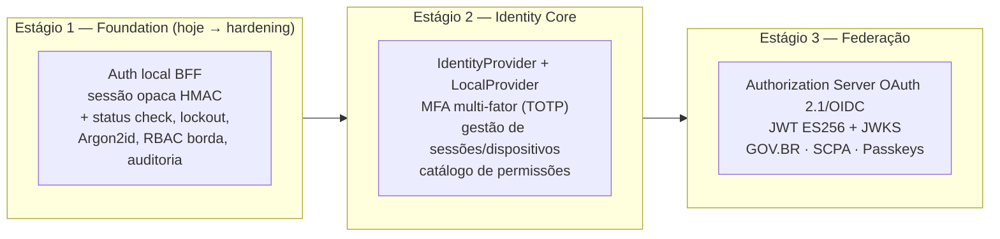

# Visão Geral

| | |
|---|---|
| **Domínio** | [[README\|Plataforma de Identidade]] |
| **Última atualização** | 2026-07-24 |

---

## 1. Contexto

O VERACIS é uma plataforma de alertas territoriais (vulnerabilidades sociais, ambientais e de saúde) com trajetória para o ecossistema do Ministério da Saúde/DATASUS. Isso impõe três consequências arquiteturais que um "módulo de login" comum não atende:

1. **Federação não é hipótese, é destino** — GOV.BR (login unificado do cidadão, OIDC) e SCPA (controle de acesso dos sistemas do MS) são integrações esperadas do ciclo de vida do projeto. A arquitetura precisa recebê-las **sem alterar nenhuma API de negócio**.
2. **Conformidade é requisito, não diferencial** — LGPD (Lei 13.709/2018), ePING (interoperabilidade por padrões abertos) e trilha de auditoria confiável deixam de ser "boa prática" e viram critério de aceite.
3. **Horizonte de décadas** — sistemas governamentais vivem 10+ anos. Toda decisão aqui é avaliada por manutenção de longo prazo e aderência a padrões abertos (RFCs, NIST, OWASP, OpenID Foundation), não por conveniência imediata.

## 2. Princípios Arquiteturais

| Princípio | Significado prático | Onde se materializa |
|---|---|---|
| **Identity First** | Identidade é serviço próprio; nunca contém regra de negócio de outro domínio | ✅ já vale hoje — `domain/auth` não importa alerts/communities ([[05-Dominios]]) |
| **Provider Agnostic** | Nenhuma API conhece GOV.BR/LDAP/Google — só o contrato `IdentityProvider` | [[08-Providers]] |
| **Zero Trust** | Validação contínua de sessão, MFA, dispositivos, revogação imediata, auditoria total | [[11-Sessoes]], [[12-MFA]], [[13-Auditoria]] |
| **Security by Design** | Controles definidos antes do código (ASVS como checklist de projeto, não de correção) | [[02-Requisitos]], [[14-Seguranca]] |
| **Least Privilege** | Papéis mínimos por padrão; permissões explícitas para ações sensíveis | [[09-Autorizacao]] |
| **Open Standards** | OAuth 2.1, OIDC, WebAuthn, JOSE — nunca protocolo proprietário (exigência ePING) | [[10-Tokens]], [[21-Referencias]] |
| **Baixo acoplamento / alta coesão** | Domínios independentes com contratos explícitos e eventos | [[05-Dominios]], [[16-Eventos]] |
| **Escalabilidade horizontal** | Nenhum estado em processo; sessão e rate limit em stores compartilhados | [[04-Arquitetura]] §5 |
| **Event-driven quando necessário** | Eventos para efeitos colaterais (auditoria, e-mail) — nunca para o caminho crítico de autenticação | [[16-Eventos]] |

## 3. Visão em Fases (resumo)

A plataforma evolui em 3 estágios arquiteturais (detalhados em 10 fases operacionais no [[18-Roadmap|Roadmap]]):

Racional da ordem: cada estágio entrega valor de segurança imediato e é pré-requisito técnico do seguinte — não há "big bang". O Estágio 3 só se justifica quando existir o consumidor real (segundo cliente, federação ativada) — construir Authorization Server sem consumidor é o anti-padrão clássico de plataforma de identidade (complexidade de AS sem tráfego que a pague).

## 4. O Que Esta Plataforma Resolve

Autenticação (local e federada) · Autorização (RBAC híbrido, [[09-Autorizacao]]) · Identidade federada (vínculo multi-provider, [[06-Modelo-de-Dados]]) · Sessões e dispositivos ([[11-Sessoes]]) · Tokens ([[10-Tokens]]) · MFA ([[12-MFA]]) · Recuperação de senha ([[03-Regras-de-Negocio]] §4) · Auditoria e LGPD ([[13-Auditoria]]) · Revogação em todos os níveis · Extensibilidade por Provider Pattern ([[08-Providers]]).

## 5. O Que Esta Plataforma NUNCA Faz

- Conter regra de negócio de alertas, comunidades ou qualquer outro domínio.
- Expor detalhes de um IdP específico para fora da camada de providers.
- Armazenar senha reversível, token de sessão em claro, ou segredo em código.
- Permitir edição retroativa de registro de auditoria.

## Ver também

- [[README]] — índice
- [[00-Gap-Analysis]] — de onde partimos
- [[04-Arquitetura]] — como chegamos lá
- [[17-ADR]] — por que cada decisão
