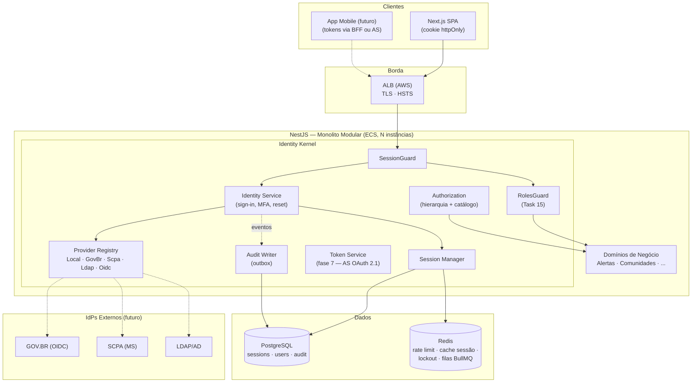

# Arquitetura

| | |
|---|---|
| **Domínio** | [[README\|Plataforma de Identidade]] |
| **Última atualização** | 2026-07-24 |

---

## 1. Decisão Estrutural: Padrão BFF com Identity Kernel no Monolito Modular

Duas decisões estruturais sustentam tudo (ADRs [[17-ADR|001, 008 e 010]]):

**(a) Padrão BFF (Backend-for-Frontend)** — o navegador nunca vê token; recebe apenas cookie `httpOnly` de sessão opaca. Tokens (quando existirem, fase 7) vivem exclusivamente server-side. Fundamento: o BCP do IETF para OAuth em aplicações browser (RFC 9700 — OAuth 2.0 Security Best Current Practice, e o draft OAuth for Browser-Based Apps) aponta o BFF como a arquitetura mais segura para SPAs, precisamente porque elimina a superfície de roubo de token via XSS. ✅ A arquitetura atual do VERACIS **já é um BFF de facto** — a proposta valida e formaliza, não substitui.

**(b) Identity Kernel** — a plataforma de identidade é um **serviço lógico** dentro do monolito modular: módulo próprio, schema/tabelas próprias, contratos próprios, eventos próprios — mas mesmo processo e deploy. Extração para serviço físico separado só quando critérios objetivos dispararem (§4). Fundamento: "monolith first" (Fowler/Newman) + realidade operacional de projeto com transferência futura para operação por terceiros — cada processo a mais é custo permanente de operação, rede, observabilidade e deploy.

## 2. Arquitetura Geral

Visões C4 completas: [[diagrams/C4-Context]], [[diagrams/C4-Container]], [[diagrams/C4-Component]]. Deployment: [[diagrams/Deployment]]. Comunicação: [[diagrams/Comunicacao-entre-Servicos]].

## 3. Camadas e Responsabilidades

| Camada | Responsabilidade | Nunca faz |
|---|---|---|
| **Borda (ALB + Helmet/CORS)** | TLS, HSTS, headers, origem única | Lógica de autenticação |
| **Guards (Session → Roles)** | Traduz cookie → sessão de domínio; corta rota por papel mínimo | Conhecer recurso de negócio |
| **Identity Kernel** | Autenticar (via providers), sessões, MFA, tokens, auditoria | Regra de negócio de qualquer outro domínio |
| **Domínios de negócio** | Policies fine-grained sobre seus recursos | Reautenticar; conhecer providers |
| **Dados** | Postgres = fonte de verdade; Redis = cache/contadores/filas | Redis nunca é fonte de verdade de sessão ([[17-ADR|ADR-012]]) |

## 4. Critérios de Extração do Identity Service (quando virar serviço físico)

Extrair **somente** quando pelo menos dois destes dispararem; registrar a decisão em ADR na hora:

1. **Segundo sistema consumidor** — outra aplicação (não outro cliente do mesmo app) precisa autenticar contra o VERACIS ⇒ o Identity Kernel vira Authorization Server compartilhado.
2. **Perfil de carga divergente** — QPS de autenticação escala em ritmo incompatível com o app (ex.: federação GOV.BR trazendo tráfego de login massivo).
3. **Fronteira de compliance** — exigência (DATASUS/auditoria) de isolamento físico de dados de credencial.
4. **Divisão organizacional** — time dedicado de identidade passa a existir.

A extração já nasce barata porque o Kernel tem: schema próprio, contratos próprios, comunicação com o resto **apenas** via interfaces e eventos ([[16-Eventos]]) — nunca import direto de entidade de negócio. O custo de manter essa disciplina hoje é baixo; o custo de não tê-la na hora de extrair seria uma reescrita.

## 5. Escalabilidade e Disponibilidade

| Aspecto | Estratégia |
|---|---|
| Escala horizontal | API stateless (nenhuma sessão em memória de processo) — N instâncias ECS atrás do ALB; ✅ já vale hoje |
| Validação de sessão em escala | Postgres (PK lookup) + cache Redis read-through com invalidação síncrona na revogação ([[11-Sessoes]] §3, ADR-012) — P99 alvo ≤10ms |
| Rate limit distribuído | Redis compartilhado (✅ já implementado via `throttler-storage-redis`) |
| Redis indisponível | Degradação graciosa: rate limit e cache falham **abertos para leitura de sessão via Postgres** e **fechados para lockout** (fail-secure onde segurança manda, fail-open onde disponibilidade manda) — detalhado em [[14-Seguranca]] §8 |
| Chaves de assinatura (fase 7) | Rotação trimestral com sobreposição via `kid`/JWKS ([[10-Tokens]] §5) |
| Multi-AZ | RDS multi-AZ + ElastiCache multi-AZ + ECS spread — infraestrutura AWS já descrita em [[Geral]] §5 |
| Milhões de usuários | Sessões: tabela particionável por data se necessário; auditoria particionada por mês desde o dia 1 ([[13-Auditoria]] §6); read replicas apenas se leitura de perfil/permissão virar gargalo medido |

## 6. Decisões Estruturais Rejeitadas (resumo — detalhe em [[17-ADR]])

| Alternativa | Por que não |
|---|---|
| Keycloak/Auth0/Cognito como IdP da plataforma | Terceiriza o núcleo de um projeto governamental de longo prazo a um produto com custo/lock-in próprios; a necessidade real (auth local + federação futura) é coberta com componentes padrão. Keycloak permanece como **opção de provider federado** (alguém autentica *nele*), não como dono da identidade |
| Microsserviço de identidade desde o dia 1 | Custo operacional permanente sem nenhum dos critérios do §4 presente |
| JWT stateless como sessão primária | Revogação imediata impossível sem denylist (que reintroduz o estado que se queria evitar) — ADR-001 |

## Ver também

- [[README]] — índice
- [[05-Dominios]]
- [[11-Sessoes]]
- [[17-ADR]]
