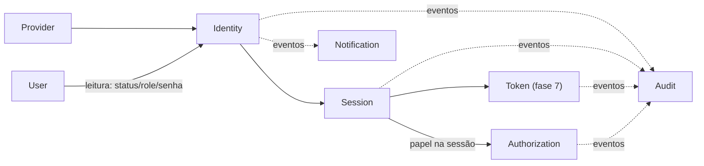

# Domínios da Plataforma

| | |
|---|---|
| **Domínio** | [[README\|Plataforma de Identidade]] |
| **Última atualização** | 2026-07-24 |

---

Oito domínios, cada um com responsabilidade, limites, dependências, eventos e entidades próprios. Todos seguem o padrão DDD/Clean já estabelecido no projeto (✅ confirmado em `domain/auth`): use cases → contratos abstratos → infra, `Either<Error, Success>`, entidades ricas, domain events.

## 1. Identity

| | |
|---|---|
| **Responsabilidade** | Provar quem é o usuário: orquestrar sign-in via providers, decidir exigência de MFA, disparar criação de sessão |
| **Estado** | ✅ Existe (`domain/auth` — use cases de sign-in/OTP/reset) — a refatorar para orquestrador de providers |
| **Depende de** | [[#8-provider\|Provider]] (autenticação), [[#2-user\|User]] (status/role/e-mail — só leitura), [[#5-session\|Session]] (emissão), Cryptography |
| **Entidades** | `OtpChallenge`, `PasswordReset`, `EmailVerificationToken` (proposta) |
| **Eventos que emite** | `LoginSucceeded`🎯, `LoginFailed`🎯, `PasswordChanged`✅, `PasswordResetRequested`✅, `OtpCodeRequested`✅ |
| **APIs** | `/session/sign-in`, `/session/send-otp-code`, `/session/verify-otp-code`, `/request|confirm/password/reset` ([[15-API]]) |
| **Nunca** | Conter regra de negócio de outro domínio; conhecer um provider concreto fora do registry |

## 2. User

| | |
|---|---|
| **Responsabilidade** | Dados cadastrais (nome, CPF, e-mail, papéis, comunidades) — **fonte**: [[Regras-de-Negocio/Usuarios/Usuarios\|Regras de Negócio — Usuários]] |
| **Estado** | ✅ Existe (`domain/users`) — não documentado aqui, só a fronteira |
| **Fronteira** | Identity **lê** User (senha, status, role); User **nunca** conhece sessões, tokens ou providers. Direção única |
| **Nunca** | Autenticar; validar sessão |

## 3. Authorization

| | |
|---|---|
| **Responsabilidade** | Decidir se identidade autenticada pode agir — duas camadas ([[09-Autorizacao]]): borda (papel mínimo) e domínio (policies + catálogo) |
| **Estado** | 🟡 Papel global existe; guard de borda planejado (Task 15); catálogo proposto |
| **Depende de** | Sessão resolvida (papel), catálogo de permissões (fase 3) |
| **Entidades** | `Role`🎯, `Permission`🎯, `RolePermission`🎯, `UserRoleAssignment`🎯 |
| **Eventos** | `RoleChanged`🎯, `PermissionChanged`🎯 |
| **Nunca** | Ser confundido com autenticação; conhecer HTTP dentro das policies |

## 4. Audit

| | |
|---|---|
| **Responsabilidade** | Trilha imutável de todo evento de identidade/autorização ([[13-Auditoria]]) |
| **Estado** | ❌ Não existe — 100% proposto |
| **Depende de** | Eventos dos demais domínios (consumidor puro — nunca é dependência de ninguém no caminho crítico) |
| **Entidades** | `AuditLog` (append-only) |
| **Nunca** | Perder eventos; permitir edição retroativa; bloquear o fluxo de autenticação se a escrita falhar (buffer/outbox, não acoplamento síncrono) |

## 5. Session

| | |
|---|---|
| **Responsabilidade** | Ciclo de vida da sessão: emissão, validação, renovação, revogação (unitária/por dispositivo/global), listagem ([[11-Sessoes]]) |
| **Estado** | 🟡 Núcleo existe (`Session` entity, guard, sign-out unitário); dispositivos/global/teto absoluto propostos |
| **Depende de** | Postgres (verdade), Redis (cache — ADR-012) |
| **Entidades** | `Session`✅, `TrustedDevice`🎯 |
| **Eventos** | `SessionRevoked`🎯, `SessionsRevokedGlobally`🎯 |
| **Nunca** | Confiar em cache para decisão de revogação; expor o token em claro após a emissão |

## 6. Token

| | |
|---|---|
| **Responsabilidade** | Emissão/rotação/revogação de tokens OAuth 2.1/OIDC (access JWT, refresh opaco, ID token) — **fase 7** ([[10-Tokens]]) |
| **Estado** | ❌ Não existe (e não deve existir antes de haver consumidor — ADR-008) |
| **Depende de** | Session (vínculo `sessionId` nos claims), chaves de assinatura (KMS/Secrets Manager), JWKS endpoint |
| **Entidades** | `RefreshToken`🎯 |
| **Eventos** | `TokenRefreshed`🎯, `TokenRevoked`🎯, `RefreshReuseDetected`🎯 (sinal de replay — dispara revogação em cadeia) |
| **Nunca** | Emitir HS256; emitir access token de longa duração; guardar refresh em claro |

## 7. Notification

| | |
|---|---|
| **Responsabilidade** | Entregar comunicações da identidade (código OTP, link de reset, alerta de novo dispositivo) — **transporte**, não decisão |
| **Estado** | ✅ Existe de facto — fila `MAIL` BullMQ + subscribers (`on-otp-code-requested`, `on-password-reset-requested`) |
| **Depende de** | Eventos da Identity (consumidor); infraestrutura de e-mail |
| **Nunca** | Decidir *se* uma notificação deve existir (isso é regra da Identity); bloquear o fluxo de auth se o e-mail falhar (já é assíncrono via fila ✅) |

## 8. Provider

| | |
|---|---|
| **Responsabilidade** | Abstrair todo IdP atrás de `IdentityProvider`; normalizar retorno em `IdentityResult`; registry dinâmico ([[08-Providers]]) |
| **Estado** | ❌ Não existe — a lógica local vive dentro do `SignInUseCase` (a extrair) |
| **Entidades** | `Identity`🎯 (vínculo user ↔ provider externo — a peça que falta no modelo atual, [[06-Modelo-de-Dados]] §2) |
| **Nunca** | Vazar formato nativo de um IdP para fora; conter `if (provider === "x")` fora do registry |

## 9. Mapa de Dependências entre Domínios

Setas cheias = dependência de contrato (síncrona). Tracejadas = eventos (assíncrona). **Audit e Notification são folhas** — ninguém depende deles; podem falhar sem derrubar autenticação.

## Ver também

- [[README]] — índice
- [[04-Arquitetura]]
- [[06-Modelo-de-Dados]]
- [[16-Eventos]]
