# Modelo de Dados

| | |
|---|---|
| **Domínio** | [[README\|Plataforma de Identidade]] |
| **Código-fonte** | `apps/api/prisma/models/{user,session,otp-challenge,password-reset,membership}.prisma` |
| **Última atualização** | 2026-07-24 |

---

## 1. Entidades Existentes — ✅ Confirmado

| Entidade | Responsabilidade | Observação de projeto |
|---|---|---|
| `User` | Dados cadastrais + `status`, `role` global, `password` (hash), `otpEnabled` | `cpf`/`email` únicos; papel é global (não por comunidade — decisão pendente na Task 15/Passo 4) |
| `Session` | Sessão server-side; **`id` é o hash HMAC do token** (nunca o token em claro) | `userAgent`/`ipAddress` capturados; falta `absoluteExpiresAt` (proposto) |
| `OtpChallenge` | Desafio MFA por e-mail com máquina de estados e contador de tentativas | Generaliza para `MfaSecret` sem redesenho |
| `PasswordReset` | Token de reset; `id` é o próprio token-hash; uso único via `usedAt` | Padrão de referência para novos tokens de e-mail |
| `Membership` | Vínculo user↔comunidade (PK composta), **sem papel** | Pertence ao domínio User |

## 2. Entidades Propostas — 🎯

| Entidade | Responsabilidade | Por que existe |
|---|---|---|
| `Identity` | Vínculo usuário ↔ identidade federada: `userId`, `provider`, `externalId`, `email`, `rawClaims`, `linkedAt` | **A peça que falta para federação.** Sem ela, "logar com GOV.BR" exigiria gambiarras no `User`. Um usuário pode ter N identidades (local + GOV.BR + Azure); `(provider, externalId)` único |
| `Role` | Papel nomeado do catálogo fino (`"Gestor de Comunidade"`) | Camada 2 da autorização ([[09-Autorizacao]] §4) — só na fase 3 |
| `Permission` | Permissão atômica `recurso:ação` (`alert:accept`) | Idem |
| `RolePermission` | Junção Role ↔ Permission (N:M) | Idem |
| `UserRoleAssignment` | Junção User ↔ Role (N:M) — nome evita colisão com o enum `UserRole` existente | Idem |
| `RefreshToken` | Refresh opaco: `id` = hash (mesmo padrão de `Session`), `sessionId`, `used`, `expiresAt`, `familyId` | Rotação + detecção de reuso por família ([[10-Tokens]] §6) — fase 7 |
| `AuditLog` | Registro imutável: `eventType`, `userId?`, `provider`, `result`, `ip`, `userAgent`, `correlationId`, `requestId`, `metadata`, `createdAt` | Sem `updatedAt`, sem delete ([[13-Auditoria]]) |
| `MfaSecret` | Fator MFA por usuário: `type` (EMAIL_OTP/TOTP/WEBAUTHN), `secretEncrypted`, `confirmedAt`, `lastUsedAt` | Multi-fator sem redesenhar fluxo ([[12-MFA]]) |
| `TrustedDevice` | Dispositivo confiável: `fingerprint`, `label`, `trustedAt`, `expiresAt` | Reduz fricção de MFA com expiração (Zero Trust: confiança nunca permanente) |
| `EmailVerificationToken` | Verificação de e-mail — mesmo padrão de `PasswordReset` (hash como id, TTL, uso único) | Pré-requisito para elevar confiança da conta local |
| `AuthenticationAttempt` | Contador de falhas por conta para lockout | **Decisão de implementação**: contador em Redis com TTL (não tabela) é suficiente e mais barato ([[14-Seguranca]] §4); a entidade só vira tabela se compliance exigir histórico persistente de tentativas — registrado para não parecer esquecimento |

## 3. ERD Completo

```mermaid
erDiagram
    User ||--o{ Session : possui
    User ||--o{ Identity : "vincula (federação)"
    User ||--o{ OtpChallenge : possui
    User ||--o{ PasswordReset : possui
    User ||--o{ EmailVerificationToken : possui
    User ||--o{ MfaSecret : "fatores MFA"
    User ||--o{ TrustedDevice : confia
    User ||--o{ AuditLog : gera
    User ||--o{ UserRoleAssignment : possui
    User ||--o{ Membership : "pertence a comunidades"
    Role ||--o{ UserRoleAssignment : "atribuído a"
    Role ||--o{ RolePermission : agrega
    Permission ||--o{ RolePermission : "concedida em"
    Session ||--o{ RefreshToken : "gera (fase 7)"

    User {
        string id PK
        Status status "ACTIVED|DISABLED|BLOCKED"
        UserRole role "enum hierárquico global"
        string cpf UK
        string email UK
        string password "hash Argon2id (alvo)"
        boolean otpEnabled
    }
    Identity {
        string id PK
        string userId FK
        string provider "local|govbr|scpa|ldap|..."
        string externalId "UK com provider"
        json rawClaims "payload original p/ auditoria"
        datetime linkedAt
    }
    Session {
        string id PK "hash HMAC do token"
        string userId FK
        datetime expiresAt "deslizante 7d"
        datetime absoluteExpiresAt "teto 30d (proposto)"
        string userAgent
        string ipAddress
    }
    RefreshToken {
        string id PK "hash"
        string sessionId FK
        string familyId "cadeia p/ replay detection"
        boolean used
        datetime expiresAt
    }
    MfaSecret {
        string id PK
        string userId FK
        MfaFactorType type
        string secretEncrypted
        datetime confirmedAt "null = não ativo"
    }
    TrustedDevice {
        string id PK
        string userId FK
        string fingerprint
        datetime expiresAt "confiança expira"
    }
    AuditLog {
        string id PK
        AuditEventType eventType
        string userId FK "nullable (pré-auth)"
        string provider
        string result "SUCCESS|FAILURE"
        string correlationId
        datetime createdAt "imutável"
    }
    OtpChallenge {
        string id PK
        string userId FK
        OtpChallengeState state
        string codeHash
        int attempts "max 5"
        datetime expiresAt "10min"
    }
    PasswordReset {
        string id PK "token-hash"
        string userId FK
        datetime usedAt "uso único"
        datetime expiresAt "1h"
    }
    Role {
        string id PK
        string name
    }
    Permission {
        string id PK
        string resource
        string action
    }
```

## 4. Decisões de Modelagem

1. **Hash como PK** (`Session`, `PasswordReset`, `RefreshToken`): o identificador é derivado do segredo via HMAC — lookup O(1) por índice de PK, token em claro nunca no banco. Padrão já validado no código atual; replicado nas entidades novas.
2. **`Identity` separada de `User`**: um usuário local que depois vincula GOV.BR não muda de conta — ganha uma linha em `Identity`. A conta local também vira uma `Identity` (`provider: "local"`) na fase 8, unificando o modelo. Estratégia de vínculo (auto por CPF vs. vínculo explícito) é decisão por provider ([[08-Providers]] §6).
3. **Enum `UserRole` coexiste com catálogo**: o enum hierárquico continua sendo a camada coarse; `Role`/`Permission` são a camada fina opcional — não há migração destrutiva do enum ([[09-Autorizacao]]).
4. **Índices**: toda entidade nova nasce com índice nas FKs consultadas — lição da auditoria de [[Banco-de-Dados/04-Indices/Indices-Recomendados|Banco de Dados]] (a tabela `alerts` nasceu sem nenhum). `AuditLog` particionada por mês desde o início.

## Ver também

- [[README]] — índice
- [[05-Dominios]]
- [[10-Tokens]]
- [[Banco-de-Dados/Banco-de-Dados|Banco de Dados — auditoria de índices]]
