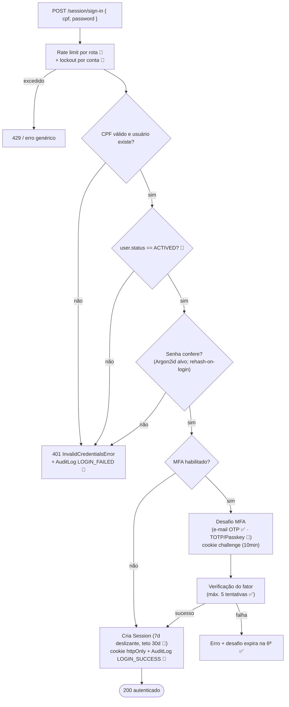
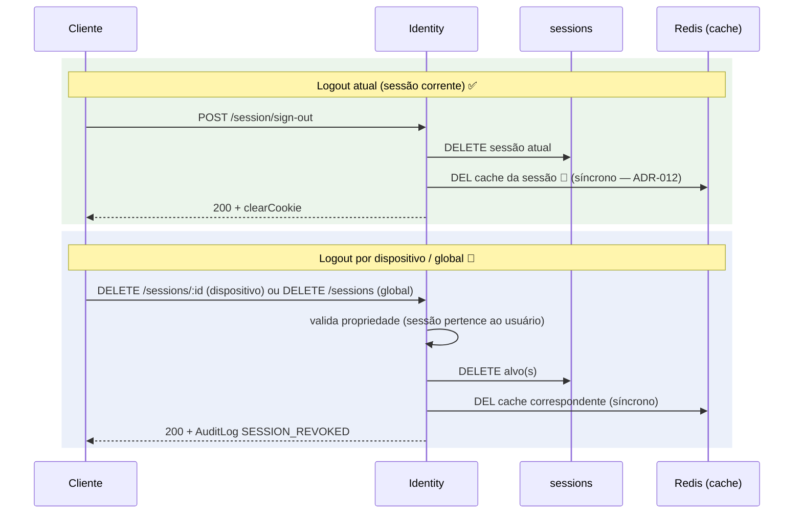
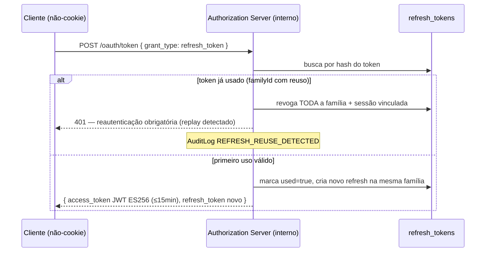
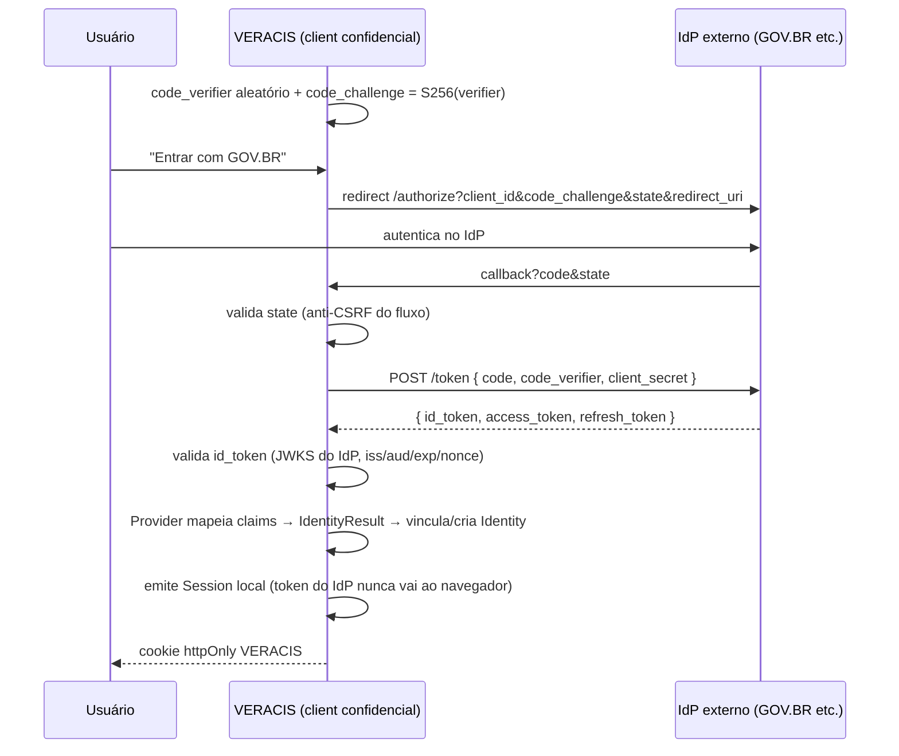
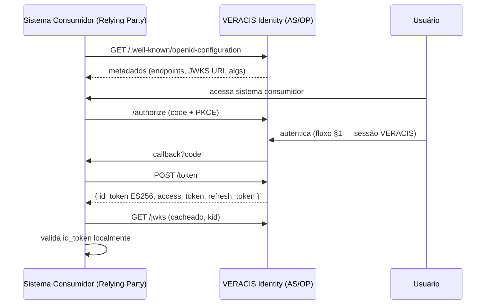
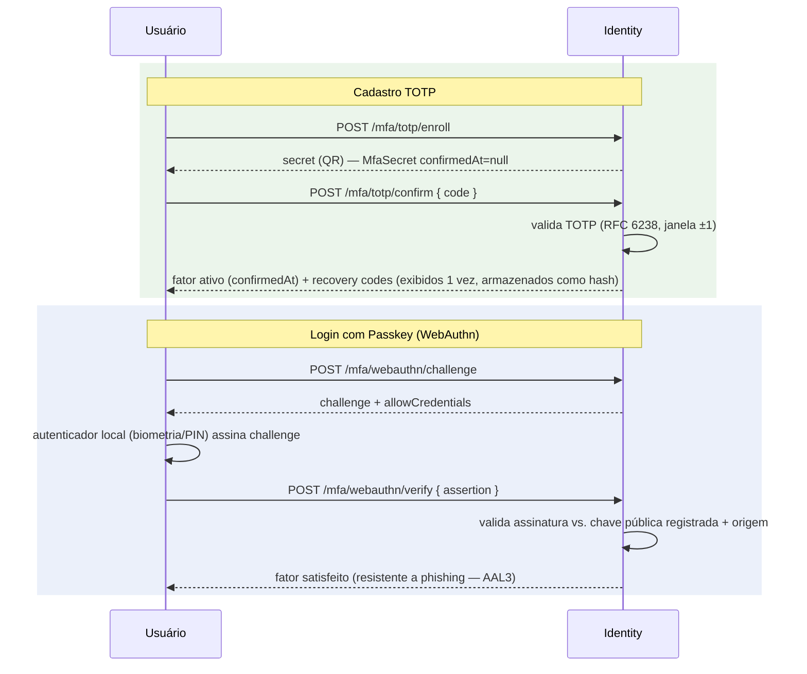
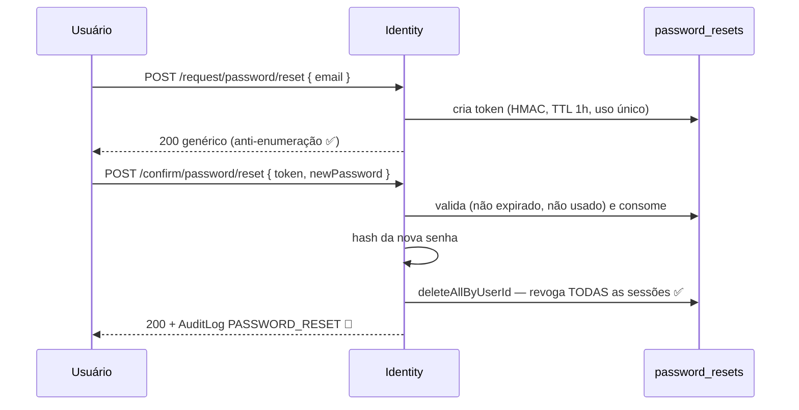
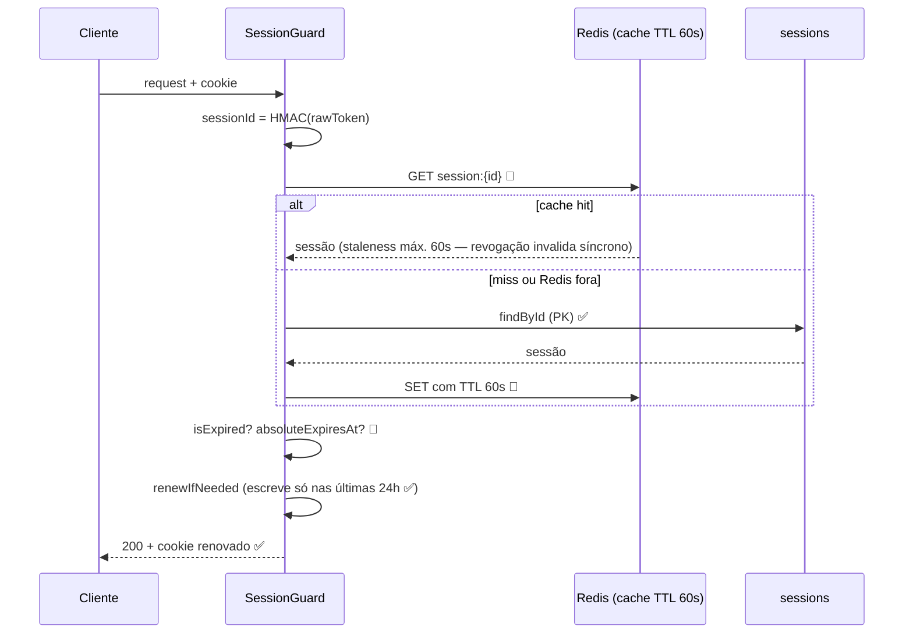
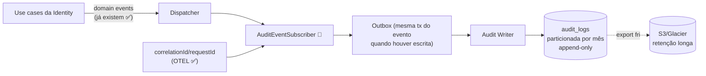

# Fluxos

| | |
|---|---|
| **Domínio** | [[README\|Plataforma de Identidade]] |
| **Última atualização** | 2026-07-24 |

---

Cada fluxo indica se é ✅ atual (confirmado no código) ou 🎯 alvo. Os diagramas alvo já incluem as correções do [[00-Gap-Analysis|Gap Analysis]] (status check, lockout, auditoria).

## 1. Login (alvo — atual + correções)

## 2. Logout (unitário ✅ · por dispositivo/global 🎯)

## 3. Refresh com Rotação (🎯 fase 7)

## 4. OAuth 2.1 — Authorization Code + PKCE (🎯 VERACIS consumindo IdP externo)

PKCE obrigatório mesmo em client confidencial (OAuth 2.1); `state`+`nonce` contra CSRF/replay do fluxo (RFC 9700).

## 5. OIDC — VERACIS como Authorization Server (🎯 fase 7, se houver 2º sistema consumidor)

## 6. MFA — TOTP e Passkey (🎯)

## 7. Password Reset (✅ atual — fluxo de referência)

## 8. Validação de Sessão em Escala (✅ núcleo · cache 🎯)

## 9. Auditoria (🎯)

Falha na escrita de auditoria **nunca** bloqueia autenticação (fila com retry); perda de evento é alarmada, não silenciada — detalhes em [[13-Auditoria]] §4.

## Ver também

- [[README]] — índice (mapa de todos os diagramas)
- [[11-Sessoes]] · [[10-Tokens]] · [[12-MFA]] · [[13-Auditoria]]
- `diagrams/` — C4, deployment, canvases v1
