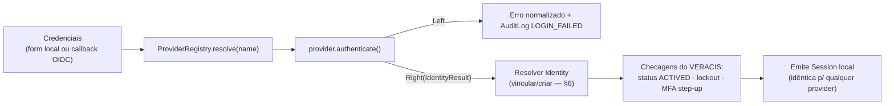

# Providers

| | |
|---|---|
| **Domínio** | [[README\|Plataforma de Identidade]] |
| **Última atualização** | 2026-07-24 |

---

## 1. O Contrato — 🎯 Proposto (ADR-003)

```ts
export interface IdentityCredentials { [key: string]: unknown } // shape por provider

export interface IdentityResult {
  externalId: string;                 // id no provider (local: o próprio userId)
  email: string | null;
  name: string | null;
  provider: string;                   // "local" | "govbr" | "scpa" | "ldap" | ...
  assuranceLevel?: "AAL1" | "AAL2" | "AAL3"; // nível de garantia que o provider atesta
  raw?: Record<string, unknown>;      // payload original — auditoria, nunca exposto ao cliente
}

export abstract class IdentityProvider {
  abstract readonly name: string;
  abstract authenticate(c: IdentityCredentials): Promise<Either<AuthError, IdentityResult>>;
}
```

Regras invioláveis:

1. Nenhum use case, controller ou domínio conhece uma classe concreta — só o token `IdentityProvider`/registry via DI (mesmo padrão de inversão já usado em todos os repositórios ✅).
2. `authenticate()` **não cria sessão** — devolve `IdentityResult`; a emissão de sessão é do orquestrador (`Identity`), única para todos os providers. Evita duplicar o ciclo de sessão em cada provider.
3. Checagens do VERACIS (status da conta, lockout) ficam no orquestrador — GOV.BR não sabe se a conta local está bloqueada.
4. Zero `if (provider === "x")` fora do registry.

## 2. Catálogo de Providers

| Provider | Protocolo | Particularidades | Fase |
|---|---|---|---|
| **LocalProvider** | CPF+senha (interno) | Extração do que hoje vive em `SignInUseCase` — refactor sem mudança de contrato externo | 2 |
| **GovBrProvider** | OIDC (Authorization Code + PKCE) | Níveis de conta Bronze/Prata/Ouro → mapear para `assuranceLevel` (Bronze=AAL1; Prata/Ouro≈AAL2+); `sub` costuma ser CPF — vínculo natural com conta local; validar id_token via JWKS do GOV.BR | 10 |
| **ScpaProvider** | Conforme documentação técnica do SCPA (SSO institucional do MS) | Perfis de acesso do SCPA mapeiam para o catálogo `recurso:ação` ([[09-Autorizacao]] §4) — a heterogeneidade fica DENTRO do provider | 10 |
| **LdapProvider** | Bind LDAP/AD (usuário+senha direto, sem redirect) | Uso institucional interno; atributos (`cn`, `mail`, `memberOf`) → `IdentityResult` | 8+ |
| **OidcProvider (genérico)** | OIDC Discovery parametrizável (issuer, client, scopes) | Cobre Azure AD, Google, Keycloak, Auth0, Cognito e qualquer OP compliant com **uma** classe — providers dedicados só quando houver particularidade real (ex.: níveis GOV.BR) | 8 |
| **SamlProvider** | SAML 2.0 | Só se um IdP concreto exigir — legados corporativos/governamentais; não construir sem demanda | — |

> [!tip] `passport-google-oauth20`, `passport-jwt` etc. já instalados (sem uso ✅) podem viver **dentro** de um provider como detalhe de implementação — o contrato `IdentityProvider` isola a lib. Decisão manter/remover: task IDP-024.

## 3. Registry e Resolução

```ts
// infra/auth/providers/provider-registry.ts
@Injectable()
export class ProviderRegistry {
  private readonly providers = new Map<string, IdentityProvider>();
  register(p: IdentityProvider) { this.providers.set(p.name, p); }
  resolve(name: string): IdentityProvider {
    const p = this.providers.get(name);
    if (!p) throw new UnknownProviderError(name);
    return p;
  }
}
```

Providers se auto-registram no bootstrap do módulo. Adicionar um provider = 1 classe nova + 1 registro — **zero alteração** em `SessionGuard`, `ValidateSessionUseCase`, controllers de negócio ou modelo de sessão.

## 4. Fluxo Interno Pós-Provider (comum a todos)



## 5. Elevação de Garantia (Step-up)

`IdentityResult.assuranceLevel` permite política de step-up: login via provider de menor garantia (ex.: conta GOV.BR Bronze) pode exigir fator adicional local antes de ações sensíveis. A política vive na Identity (orquestrador), nunca no provider — mantém o provider como fonte de fato ("o que o IdP atesta") e a Identity como fonte de política ("o que exigimos").

## 6. Vínculo de Identidade Federada (Account Linking)

| Estratégia | Quando usar | Risco |
|---|---|---|
| **Auto-vínculo por CPF** | GOV.BR (o `sub` é CPF verificado pelo governo) | Baixo — CPF já é o identificador único local e o IdP o verifica |
| **Auto-vínculo por e-mail** | IdPs que verificam e-mail (Google, Azure) | Médio — exige e-mail verificado dos DOIS lados; e-mail reciclado é vetor de account takeover conhecido |
| **Vínculo explícito** | Usuário logado localmente "conecta" o provider externo | Mínimo — recomendado como padrão para todo IdP que não atesta CPF |

Decisão por provider, registrada como ADR no momento da integração real. A tabela `Identity` ([[06-Modelo-de-Dados]] §2) suporta as três sem mudança de schema.

## 7. Checklist para Todo Provider Novo

- [ ] Classe isolada implementando `IdentityProvider`; libs de terceiro só dentro dela
- [ ] Mapeamento payload-IdP → `IdentityResult` documentado (campo a campo)
- [ ] Estratégia de vínculo decidida e registrada (§6)
- [ ] `assuranceLevel` mapeado
- [ ] Registrado no `ProviderRegistry`; zero mudança fora do módulo de providers
- [ ] `AuditLog` com `provider` correto em sucesso e falha
- [ ] Testes: contrato (mock do IdP) + integração do fluxo completo

## Ver também

- [[README]] — índice
- [[05-Dominios]] §8
- [[07-Fluxos]] §4 (OAuth/PKCE)
- [[17-ADR]] — ADR-003
