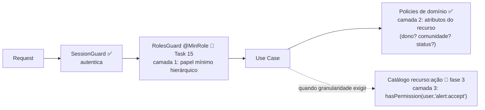

# Autorização

| | |
|---|---|
| **Domínio** | [[README\|Plataforma de Identidade]] |
| **Última atualização** | 2026-07-24 |

---

> [!important] Esta página é o resumo do lado da Identidade. A arquitetura completa da autorização (motor de decisão, ownership, escopos, cache, API administrativa, roadmap próprio) está em [[Autorizacao/README|Plataforma de Autorização]] — documentação dedicada que aprofunda as decisões daqui (ADR-004/ADR-009) sem alterá-las.

## 1. Avaliação dos Modelos

| Modelo | Como funciona | Força | Fraqueza | Adequação ao VERACIS |
|---|---|---|---|---|
| **RBAC** (NIST/INCITS 359) | Permissões agregadas em papéis; usuário recebe papéis | Simples de raciocinar, auditar e administrar; padrão em gov | Explosão de papéis quando o contexto importa ("líder DESTA comunidade") | ✅ Base correta — 4 papéis hierárquicos já existem e cobrem o domínio atual |
| **ABAC** (NIST SP 800-162) | Decisão por atributos de sujeito/recurso/ambiente avaliados por policy | Expressividade máxima (contexto, horário, relação com o recurso) | Complexidade de gestão/auditoria; difícil responder "quem pode X?" | 🟡 Necessário **pontualmente** — as policies de domínio existentes (`health-alert-visibility` ✅) já são ABAC de facto sobre atributos do recurso |
| **PBAC / Policy Engine externo** (OPA/Rego, Cedar/AVP) | PDP centralizado avaliando policies versionadas | Governança central, policies como artefato | Latência por decisão, mais um runtime para operar, curva Rego/Cedar | ❌ Rejeitado por ora — time e escala atuais não pagam o custo; revisitar se multi-tenant ou >3 tipos de cliente |
| **Híbrido em camadas** | RBAC coarse na borda + policies/atributos no domínio + catálogo fino opcional | Cada pergunta respondida pela camada mais barata que a resolve | Duas camadas mentais para o time | ✅ **Escolhido** (ADR-009) |

## 2. A Decisão: Híbrido em Três Camadas

> [!important] Regra de ouro (herdada da Task 15 — decisão de time já registrada, mantida)
> **Guard decide "pode entrar na rota"** (coarse, por papel). **Domínio decide "pode agir sobre ESTE recurso"** (fine, por policy pura). Guard não conhece recurso; policy não conhece HTTP.

**Camada 1 — RBAC hierárquico de borda** (Task 15, ✅ desenho pronto): `@MinRole("MANAGER")` + `RolesGuard`, hierarquia estrita ROOT⊃MANAGER⊃LEADER⊃MEMBER. Um decorator, zero tabela, 403 antes do use case. Rota sem anotação = qualquer autenticado (adoção incremental).

**Camada 2 — Policies de domínio** (✅ já existem): funções puras sobre atributos (`canViewHealthAlert(user, alert)`) — é ABAC aplicado onde ABAC é necessário, sem engine externa. Testáveis isoladamente, sem HTTP.

**Camada 3 — Catálogo `recurso:ação`** (🎯 fase 3): `Permission`/`Role`/`RolePermission`/`UserRoleAssignment` ([[06-Modelo-de-Dados]]) para quando o produto exigir composição fina que a hierarquia não expressa (ex.: "aceita alerta mas não bloqueia usuário"). Ativada **somente onde exigida** — as rotas que a hierarquia resolve nunca pagam consulta ao catálogo.

## 3. Por Que Não Substituir a Hierarquia pelo Catálogo

A pergunta mais frequente de borda ("é staff?") é respondida pelo enum já presente na sessão — O(1), sem I/O. Migrar 100% das rotas para permission-check transformaria toda decisão de autorização em consulta adicional, para expressividade que hoje **nenhuma regra de negócio demanda** (verificado: todos os conjuntos de papéis do domínio atual são contíguos na hierarquia — análise da Task 15). Princípio: a camada mais barata que responde a pergunta, responde a pergunta.

## 4. Catálogo — Exemplos Concretos e Mapeamento SCPA

| Permission | Significado |
|---|---|
| `alert:create` / `alert:accept` / `alert:delete` | Ciclo do alerta |
| `community:manage` / `community:view-metrics` | Gestão territorial |
| `user:block` | Administração de contas |
| `category:manage` | Dado de referência |

Relevância governamental: o SCPA administra **perfis de acesso** para sistemas do Ministério da Saúde. Perfil SCPA ≈ `Role` agregando `Permissions` — quando a integração vier (fase 10), o perfil SCPA mapeia para uma `Role` do catálogo dentro do `ScpaProvider`, sem tocar o modelo. A camada 3 é, portanto, também a **ponte de interoperabilidade** com o modelo de acesso do MS, não só refinamento interno.

## 5. Preparação ABAC Sem Engine

Se atributos ambientais (horário, origem, nível de garantia do login — [[08-Providers]] §5) precisarem entrar em decisões, entram como parâmetros das policies de domínio existentes — assinatura muda, arquitetura não. PDP externo (OPA/Cedar) só entra se as policies precisarem ser administradas por não-desenvolvedores ou compartilhadas entre múltiplos serviços — gatilhos registrados em ADR-009.

## Ver também

- [[README]] — índice
- [[06-Modelo-de-Dados]] §2
- [[Análise Arquitetural - Alerts/tasks/15 - RBAC de permissionamento por roles/15 - RBAC de permissionamento por roles|Task 15 — RBAC]] (camada 1, desenho completo)
- [[17-ADR]] — ADR-009
