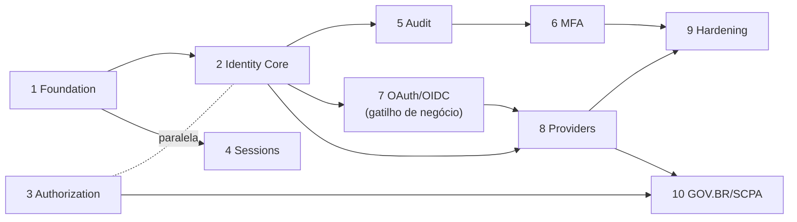

# Roadmap

| | |
|---|---|
| **Domínio** | [[README\|Plataforma de Identidade]] |
| **Última atualização** | 2026-07-24 |

---

> [!warning] Estimativas são ordem de grandeza (dev-semanas de 1 pessoa focada), para priorização relativa — não compromisso de prazo. Refinar por fase no planning.

## Fase 1 — Foundation (hardening do que existe)

| | |
|---|---|
| **Objetivo** | Fechar os gaps críticos de segurança sem mudar arquitetura |
| **Entregáveis** | Status check no sign-in (IDP-001) · lockout por conta + throttle por rota (IDP-002) · Argon2id + pepper (IDP-003) · fix `OtpChallenge.expire()` (IDP-013) · limpeza de sessões expiradas (IDP-014) |
| **Dependências** | Nenhuma |
| **Critérios de aceite** | Conta `BLOCKED` não autentica; N falhas ⇒ cooldown auditável; hashes novos são Argon2id; suite verde |
| **Riscos** | Calibração Argon2id em produção (medir latência); falso positivo de lockout (janela de graça testada) |
| **Estimativa** | ~2-3 semanas |
| **Impacto** | 🔴 Alto — elimina os três gaps de segurança confirmados |

## Fase 2 — Identity Core

| | |
|---|---|
| **Objetivo** | Extrair o Provider Pattern; formalizar o Identity Kernel |
| **Entregáveis** | `IdentityProvider` + `IdentityResult` + registry (IDP-004) · `LocalProvider` (IDP-005) · sign-in como orquestrador · fronteira de módulo com lint de imports |
| **Dependências** | Fase 1 (status/lockout já no orquestrador certo) |
| **Critérios de aceite** | Comportamento externo idêntico (testes de regressão); `SignInUseCase` sem lógica de senha; zero import de negócio no Kernel |
| **Riscos** | Refactor de fluxo crítico — mitigado por cobertura de testes antes de mover |
| **Estimativa** | ~2 semanas |
| **Impacto** | Alto (habilita fases 8-10) |

## Fase 3 — Authorization

| | |
|---|---|
| **Objetivo** | Autorização de borda + catálogo preparado |
| **Entregáveis** | `@MinRole` + `RolesGuard` (execução da Task 15, passos 1-3) · anotação das rotas staff · decisão role-por-comunidade registrada (Task 15 passo 4) · schema do catálogo criado **sem uso obrigatório** |
| **Dependências** | Nenhuma técnica (paralelizável com fase 2) |
| **Critérios de aceite** | Rota staff devolve 403 para MEMBER sem executar use case; rotas não anotadas inalteradas |
| **Riscos** | Mapeamento produto de quais rotas são staff-only |
| **Estimativa** | ~1-2 semanas |
| **Impacto** | Alto |

## Fase 4 — Sessions

| | |
|---|---|
| **Objetivo** | Gestão completa de sessões e dispositivos |
| **Entregáveis** | Teto absoluto 30d (IDP-006) · `GET/DELETE /sessions` + logout global (IDP-007) · parsing de user-agent na criação · cache Redis de sessão com invalidação síncrona (IDP-008, ADR-012) |
| **Dependências** | Fase 1 |
| **Critérios de aceite** | Usuário lista/revoga dispositivos; revogação efetiva ≤1s inclusive com cache; sessão nunca ultrapassa 30d |
| **Riscos** | Invalidação de cache — testes de corrida obrigatórios |
| **Estimativa** | ~2 semanas |
| **Impacto** | Médio-alto |

## Fase 5 — Audit

| | |
|---|---|
| **Objetivo** | Trilha de auditoria completa |
| **Entregáveis** | `AuditLog` particionada + repositório append-only (IDP-009) · eventos `LoginSucceeded/Failed` · `AuditEventSubscriber` + fila com DLQ · `REVOKE UPDATE/DELETE` · política de retenção validada com DPO (IDP-010) |
| **Dependências** | Fases 1-2 (eventos emitidos pelo orquestrador) |
| **Critérios de aceite** | Todo evento do catálogo gera registro; login não bloqueia com fila fora; imutabilidade verificada no banco |
| **Riscos** | Definição jurídica de retenção — desenho suporta qualquer prazo |
| **Estimativa** | ~2-3 semanas |
| **Impacto** | 🔴 Alto (compliance) |

## Fase 6 — MFA

| | |
|---|---|
| **Objetivo** | AAL2 real e caminho para AAL3 |
| **Entregáveis** | `MfaSecret` multi-tipo (migração do `otpEnabled`) · TOTP enroll/confirm (IDP-011) · recovery codes · trusted devices · step-up nas ações sensíveis · WebAuthn/passkeys (IDP-012 — pode deslizar para fase própria) |
| **Dependências** | Fase 5 (eventos MFA auditados) |
| **Critérios de aceite** | TOTP end-to-end; recovery code de uso único; passkey login resiste a teste de phishing simulado |
| **Riscos** | Complexidade WebAuthn (attestation) — usar lib madura (`@simplewebauthn`) |
| **Estimativa** | ~3-4 semanas (TOTP 1-1.5; WebAuthn 2+) |
| **Impacto** | Alto |

## Fase 7 — OAuth 2.1 / OIDC (Authorization Server)

| | |
|---|---|
| **Objetivo** | Emitir tokens padrão para consumidores não-cookie |
| **Entregáveis** | Endpoints AS ([[15-API]] §2) · JWT ES256 + JWKS + rotação de chave · `RefreshToken` com família e reuso (IDP-015) · denylist `jti` |
| **Dependências** | Fases 2, 4, 5. **Gatilho de negócio**: existir consumidor real (mobile/M2M/RP) — sem gatilho, a fase não inicia (ADR-008) |
| **Critérios de aceite** | RP de teste valida id_token via JWKS; reuso de refresh revoga família; rotação de chave sem invalidar tokens vigentes |
| **Riscos** | Maior fase técnica — considerar lib de AS certificada (ex.: `node-oidc-provider`) vs. construção própria: **decisão de ADR na abertura da fase** |
| **Estimativa** | ~4-6 semanas |
| **Impacto** | Alto (habilita federação) |

## Fase 8 — Providers

| | |
|---|---|
| **Objetivo** | Federação genérica funcionando |
| **Entregáveis** | Entidade `Identity` + vínculo (IDP-016) · `OidcProvider` genérico (IDP-017) · rotas `/auth/:provider/*` · 1º provider real (Google — dep já instalada) · decisão deps passport (IDP-024) |
| **Dependências** | Fases 2, 7 (parcial — consumir IdP externo não exige AS próprio) |
| **Critérios de aceite** | Login via provider externo emite sessão local idêntica; desvincular exige método alternativo ativo |
| **Riscos** | Account linking (e-mail reciclado) — estratégia por provider registrada em ADR |
| **Estimativa** | ~2-3 semanas |
| **Impacto** | Alto |

## Fase 9 — Hardening

| | |
|---|---|
| **Objetivo** | Fechamento ASVS L2 e operação |
| **Entregáveis** | CSP custom + HSTS explícito · decisão CSRF token (IDP-022) · rotação dual-secret do `SESSION_SECRET` (IDP-023) · testes de segurança automatizados ([[20-Testes]] §4) · revisão externa/pentest |
| **Dependências** | Fases 1-8 no escopo alcançado |
| **Critérios de aceite** | Checklist ASVS L2 sem itens vermelhos; pentest sem achado crítico/alto aberto |
| **Estimativa** | ~2-3 semanas + janela de pentest |
| **Impacto** | Alto |

## Fase 10 — GOV.BR / SCPA

| | |
|---|---|
| **Objetivo** | Federação governamental |
| **Entregáveis** | `GovBrProvider` (níveis → `assuranceLevel`, vínculo por CPF) (IDP-018) · `ScpaProvider` + mapeamento perfis→catálogo (IDP-019) · homologação nos ambientes oficiais |
| **Dependências** | Fases 3 (catálogo p/ SCPA), 8; credenciamento junto ao GOV.BR/MS (processo administrativo — iniciar cedo, corre em paralelo) |
| **Critérios de aceite** | Login GOV.BR em homologação ponta a ponta; perfil SCPA refletido em permissões; zero mudança em APIs de negócio (prova do Provider Pattern) |
| **Riscos** | Prazos de credenciamento externos ao time; documentação SCPA — levantar cedo |
| **Estimativa** | ~3-4 semanas de engenharia + prazos administrativos |
| **Impacto** | 🔴 Estratégico |

## Sequência e Paralelismo

## Ver também

- [[README]] — índice
- [[19-Tasks]] — backlog detalhado
- [[00-Gap-Analysis]]
