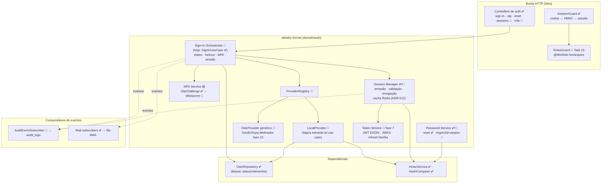

# C4 — Nível 3: Componentes do Identity Kernel

[[README|Plataforma de Identidade]] › diagrams

Legenda: ✅ existe · 🎯 proposto · 🟡 parcial. A regra de fronteira: componentes do Kernel nunca importam domínios de negócio; a comunicação de saída é só por eventos ([[16-Eventos]]).

## Ver também

- [[C4-Container]] — nível 2
- [[05-Dominios]]
