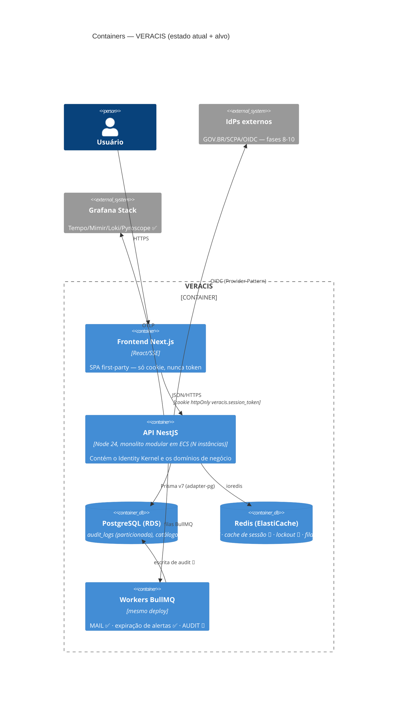

# C4 — Nível 2: Containers

[[README|Plataforma de Identidade]] › diagrams

```mermaid
C4Container
    title Containers — VERACIS (estado atual + alvo)

    Person(user, "Usuário")

    Container_Boundary(veracis, "VERACIS") {
        Container(web, "Frontend Next.js", "React/SSE", "SPA first-party — só cookie, nunca token")
        Container(api, "API NestJS", "Node 24, monolito modular em ECS (N instâncias)", "Contém o Identity Kernel e os domínios de negócio")
        ContainerDb(pg, "PostgreSQL (RDS)", "users, sessions, audit_logs (particionada), catálogo de permissões")
        ContainerDb(rd, "Redis (ElastiCache)", "rate limit ✅ · cache de sessão 🎯 · lockout 🎯 · filas BullMQ ✅")
        Container(worker, "Workers BullMQ", "mesmo deploy", "MAIL ✅ · expiração de alertas ✅ · AUDIT 🎯")
    }

    System_Ext(idp, "IdPs externos", "GOV.BR/SCPA/OIDC — fases 8-10")
    System_Ext(otel, "Grafana Stack", "Tempo/Mimir/Loki/Pyroscope ✅")

    Rel(user, web, "HTTPS")
    Rel(web, api, "JSON/HTTPS", "cookie httpOnly veracis.session_token")
    Rel(api, pg, "Prisma v7 (adapter-pg)")
    Rel(api, rd, "ioredis")
    Rel(api, worker, "filas BullMQ")
    Rel(worker, pg, "escrita de audit 🎯")
    Rel(api, idp, "OIDC (Provider Pattern)")
    Rel(api, otel, "OTLP")
```

## Ver também

- [[C4-Context]] · [[C4-Component]] · [[Deployment]]
- [[04-Arquitetura]]
