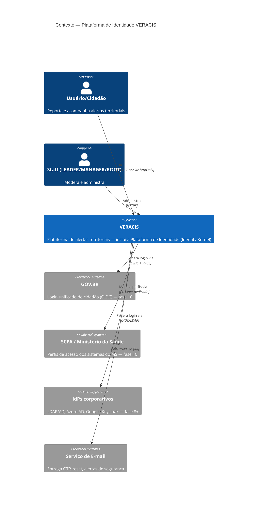

# C4 — Nível 1: Contexto

[[README|Plataforma de Identidade]] › diagrams

Fronteira central: **nenhum sistema externo fala com os domínios de negócio** — todo IdP entra pela camada de Providers do Identity Kernel ([[08-Providers]]); os domínios de negócio só conhecem a sessão local.

## Ver também

- [[C4-Container]] — nível 2
- [[04-Arquitetura]]
