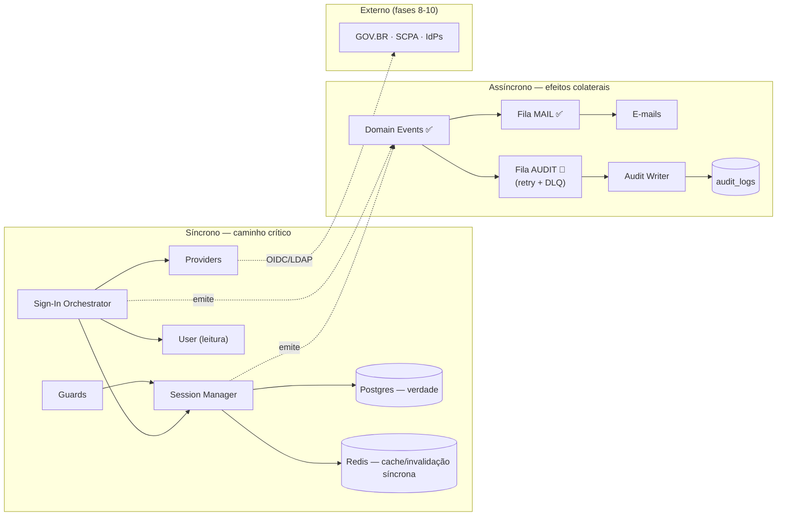

# Comunicação entre Serviços/Domínios

[[README|Plataforma de Identidade]] › diagrams

Dois regimes de comunicação, com regra estrita de quando usar cada um:

| Regime | Quando | Exemplos |
|---|---|---|
| **Síncrono (contrato/DI)** | O chamador precisa do resultado para decidir | Orquestrador → Provider; Guard → Session Manager; Identity → UserRepository (leitura) |
| **Assíncrono (evento/fila)** | Efeito colateral que não pode bloquear o caminho crítico | Auditoria, e-mails, invalidação de caches derivados |

Regras invioláveis:

1. **Caminho crítico nunca espera consumidor de evento** — login não falha porque a fila de auditoria caiu ([[16-Eventos]] §5).
2. **Domínios de negócio nunca chamam o Kernel sincronamente além dos guards** — recebem a sessão resolvida via `@CurrentSession()`; se precisarem reagir a eventos de identidade (ex.: usuário bloqueado), consomem o evento.
3. **A única leitura síncrona do Kernel para fora é `User`** (status/role/senha) — direção única, jamais o inverso.
4. Se o Kernel for extraído para serviço físico ([[04-Arquitetura]] §4), o regime síncrono vira OIDC (front-channel) e o assíncrono vira eventos entre serviços — os dois regimes já desenhados tornam essa troca de transporte, não de arquitetura.

## Ver também

- [[05-Dominios]] §9
- [[16-Eventos]]
- [[C4-Component]]
