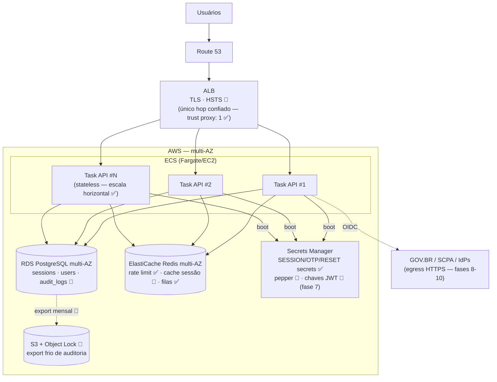

# Deployment

[[README|Plataforma de Identidade]] › diagrams

Infraestrutura AWS conforme [[Geral]] §5 (✅ ECS/ECR/RDS/ElastiCache/S3/Secrets Manager) + adições da plataforma (🎯).

Pontos operacionais:

- **Nenhum estado em processo** — qualquer task atende qualquer request (sessão em RDS+cache) ✅.
- **Falha de AZ**: RDS failover automático; ElastiCache réplica; degradação conforme [[14-Seguranca]] §8.
- **Segredos**: carregados no boot via Secrets Manager; rotação sem redeploy exige suporte dual-secret (IDP-023).
- **Auditoria fria**: export mensal para S3 Object Lock (modo compliance) — imutabilidade fora do alcance até de administrador do banco ([[13-Auditoria]] §3).

## Ver também

- [[C4-Container]]
- [[04-Arquitetura]] §5
