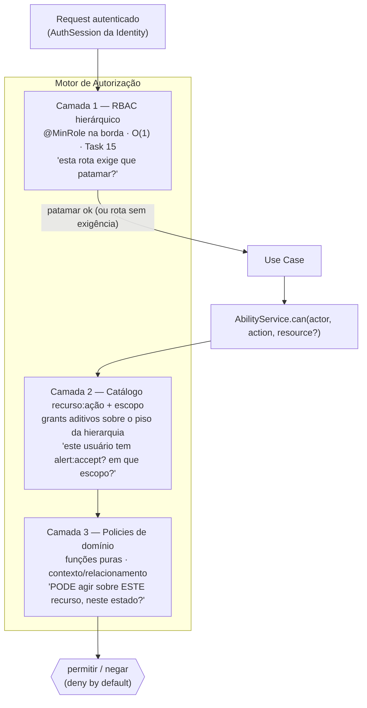

# Visão Geral

| | |
|---|---|
| **Domínio** | [[README\|Plataforma de Autorização]] |
| **Última atualização** | 2026-07-24 |

---

## 1. Fronteira Identity ↔ Authorization

| | Identity ([[Autenticacao/README\|Autenticação]]) | Authorization (esta pasta) |
|---|---|---|
| Pergunta | "Quem é você? Prove." | "Você pode fazer isto?" |
| Produz | Sessão validada: `userId`, `sessionId`, `currentUserRole`, `provider`/`assuranceLevel` (futuro) | Decisão de acesso: permitir/negar + motivo |
| Nunca faz | Decidir acesso a recurso | Autenticar, validar sessão, emitir credencial |

**O que chega pela sessão/token (fornecido pela Identity)**: `userId`, `sessionId`, `currentUserRole` (✅ hoje via `AuthSession`), e — na fase de tokens — claims `roles`, `permissions`, `provider`, `acr`, `tenant` ([[Autenticacao/10-Tokens|Tokens]] §2). **O que a Authorization resolve internamente**: grants do catálogo (camada 2), atributos do recurso (dono, comunidade, status — camada 3), membership do usuário. Regra: **a sessão carrega o barato e estável (papel); o motor consulta o volátil e contextual (grants, recurso)** — nunca inflar a sessão com o PermissionSet inteiro, que muda por administração e explodiria a invalidação.

## 2. Princípios

| Princípio | Aplicação |
|---|---|
| **Deny by default (fail-closed)** | Sem grant e sem regra que permita ⇒ negado. Erro no motor ⇒ negado, nunca "em dúvida, permite" |
| **Grant-only** | Sem permissões negativas — autorização é a **união** dos grants; ausência é a única negação (ADR-AZ-02). Elimina a classe inteira de conflitos allow×deny |
| **Least Privilege** | `MEMBER` é o default de cadastro ✅; papéis staff concedidos explicitamente e auditados |
| **A camada mais barata decide** | Hierarquia (O(1), na sessão) responde o que puder; catálogo e policies só onde necessário |
| **Policy não conhece HTTP; guard não conhece recurso** | Regra de ouro herdada da Task 15 — separação estrita de camadas |
| **Decisão única, enforcement múltiplo** | Toda pergunta "pode?" converge no `AbilityService` — guards, use cases e (futuro) frontend consomem a mesma resposta, nunca reimplementam |
| **Evolutivo sem reescrita** | Camadas aditivas: ativar catálogo/ownership/escopo por comunidade nunca quebra o que a hierarquia já resolve |

## 3. As Três Camadas (visão)

Cada camada responde uma pergunta diferente — nenhuma substitui outra. Detalhes: [[07-RBAC]] (1 e 2), [[08-Policies]] (3), [[10-CASL-ou-Estrategia]] (o motor).

## 4. Escopo Desta Plataforma

Resolve: controle de acesso, permissões, papéis, policies, ownership, contexto, escopos (dono/comunidade/global), hierarquia, preparação multi-provider (papéis vindos de SCPA — [[07-RBAC]] §5) e multi-organização ([[09-Ownership]] §5), auditoria de concessões ([[14-Auditoria]]) e evolução (camadas aditivas).

Fora de escopo, deliberadamente: multi-tenant real (organizações isoladas — reservado, mesmo status da Identidade), policy engine externo (OPA/Cedar — rejeitado com gatilhos em [[Autenticacao/17-ADR|ADR-009]], reafirmado em [[17-ADR|ADR-AZ-03]]), UI de administração de policies (policies são código — [[08-Policies]]).

## Ver também

- [[README]] — índice
- [[00-Gap-Analysis]]
- [[04-Arquitetura]]
