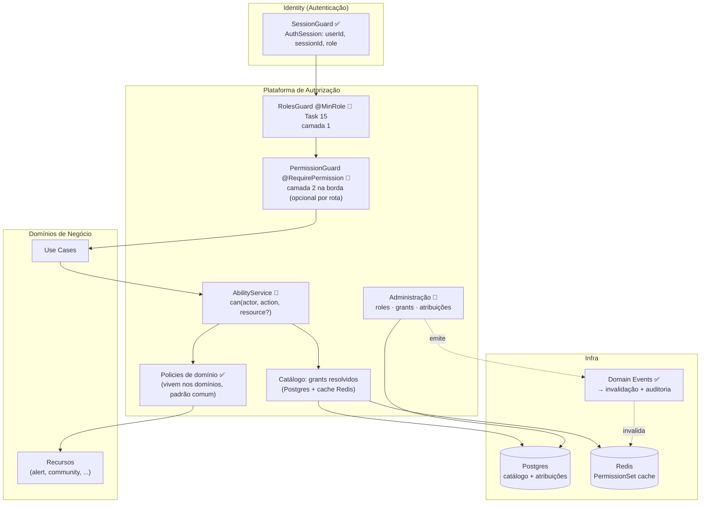
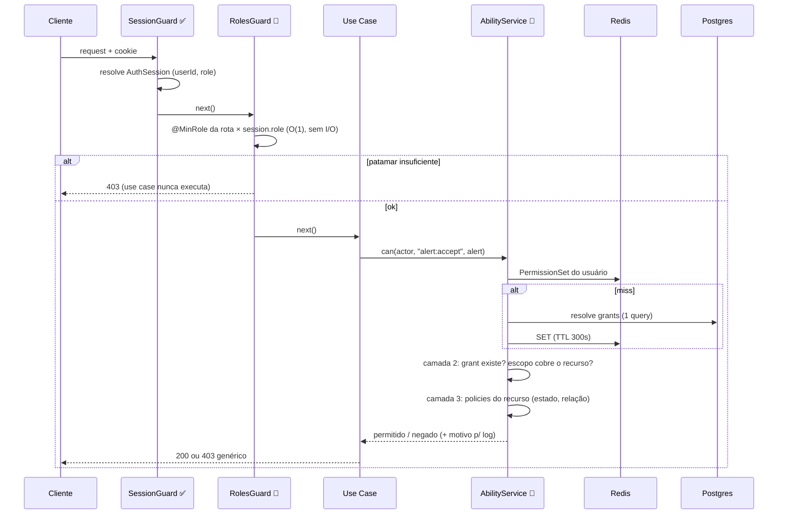

# Arquitetura

| | |
|---|---|
| **Domínio** | [[README\|Plataforma de Autorização]] |
| **Última atualização** | 2026-07-24 |

---

## 1. Posição no Sistema

A Autorização vive como **módulo do Identity Kernel** ([[Autenticacao/04-Arquitetura|Arquitetura da Identidade]] §2) — mesmo monolito modular, fronteira lógica própria (`domain/authorization` + policies que permanecem nos domínios de negócio). Ela **consome** a sessão resolvida pela Identity e **serve** decisões aos domínios de negócio. Se o Kernel for extraído ([[Autenticacao/04-Arquitetura|critérios §4]]), a Autorização decide se acompanha (permissões no token) ou permanece junto às APIs (decisão local) — as camadas já separam o que viaja no token (papel) do que é local (policies), tornando a extração um problema de transporte, não de redesenho.

## 2. Arquitetura Geral

## 3. Fluxo de Autorização (requisição típica)

Pontos de projeto:

1. **Camada 1 nunca faz I/O** — o papel já está na sessão. É por isso que ela protege *rotas*, não recursos.
2. **`can()` é o único ponto de verdade** — guards de camada 2 (`@RequirePermission("alert:accept")`, açúcar para rotas onde o recurso não importa) delegam ao mesmo serviço; use cases chamam direto quando o recurso importa. Nenhuma decisão duplicada.
3. **Motivo da negação** vai para log/auditoria com detalhe; ao cliente, 403 genérico (RNF-08).
4. **Piso da hierarquia** entra na camada 2 como grants implícitos ([[07-RBAC]] §3) — o `can()` não trata "papel" e "grant" como mundos diferentes; o papel é uma fonte de grants.

## 4. Onde Cada Pergunta É Respondida

| Pergunta | Camada | Custo |
|---|---|---|
| "Esta rota é de staff?" | 1 — `@MinRole` | O(1), sem I/O |
| "Pode executar `report:export`?" (sem recurso específico) | 2 — grant no PermissionSet | cache hit O(1) |
| "Pode editar ESTE alerta?" | 2 (grant+escopo) **e** 3 (estado/relação) | cache + atributos já carregados do recurso |
| "Pode ver alerta de saúde X?" | 3 — policy existente ✅ (`health-alert-visibility`) | função pura |
| "Frontend: que botões mostrar?" | `GET /me/abilities` — projeção do mesmo motor | 1 chamada cacheável |

## 5. Decisões Estruturais (resumo — [[17-ADR]])

| Decisão | ADR |
|---|---|
| 3 camadas aditivas; hierarquia é piso | AZ-01 |
| Grant-only, deny by default | AZ-02 |
| Motor próprio (funções puras + `AbilityService`); CASL avaliado e adiado com gatilhos | AZ-03 |
| Escopo (OWN/COMMUNITY/ANY) no grant, não no nome da permissão | AZ-04 |
| Cache de PermissionSet em Redis, invalidação síncrona por evento | AZ-05 |
| Auditoria unificada na trilha da plataforma (sem segunda trilha) | AZ-06 |
| Organização = Comunidade; multi-org adiado com gatilhos | AZ-07 |

## Ver também

- [[README]] — índice
- [[diagrams/C4-Component]] — componentes detalhados
- [[10-CASL-ou-Estrategia]] — o motor
