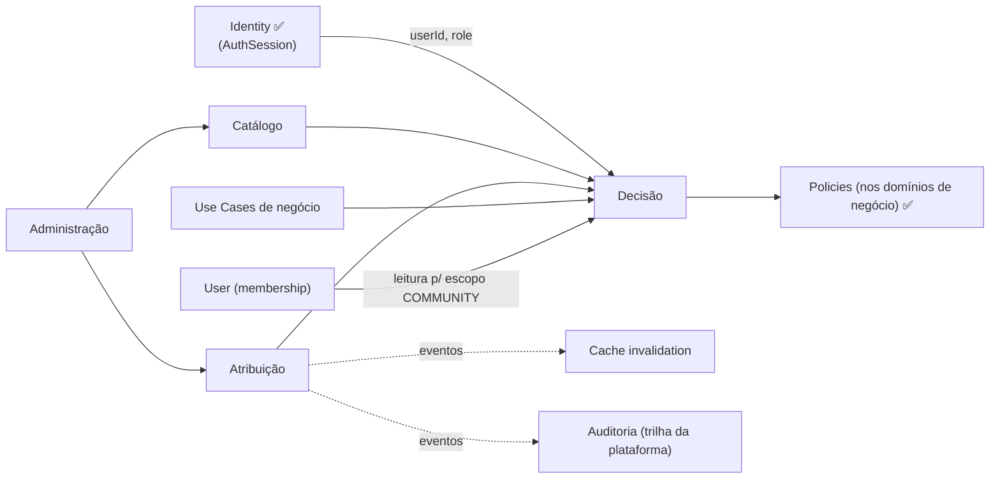

# Domínios (Subdomínios da Autorização)

| | |
|---|---|
| **Domínio** | [[README\|Plataforma de Autorização]] |
| **Última atualização** | 2026-07-24 |

---

Quatro subdomínios, mesmo padrão DDD/Clean do projeto (use cases → contratos → infra, `Either`, eventos):

## 1. Catálogo (Catalog)

| | |
|---|---|
| **Responsabilidade** | Definir o vocabulário: recursos, ações, permissões (`recurso:ação`), papéis do catálogo e seus grants |
| **Entidades** | `Role`, `Permission`, `RolePermission` |
| **Origem dos dados** | **Seed versionado em código** ([[06-Modelo-de-Dados]] §3) — permissões acompanham o código que as aplica |
| **Nunca** | Conter lógica de decisão; ser alterado em runtime fora da administração auditada |

## 2. Atribuição (Assignment)

| | |
|---|---|
| **Responsabilidade** | Vincular usuários a papéis do catálogo (com escopo), gerir concessão/revogação |
| **Entidades** | `UserRoleAssignment` (userId, roleId, escopo, communityId?, grantedBy, reason) |
| **Eventos** | `UserRoleAssigned`, `UserRoleRemoved` ([[12-Eventos]]) |
| **Nunca** | Permitir auto-atribuição (RN-010); mutar sem `reason` (RN-011) |

## 3. Decisão (Decision)

| | |
|---|---|
| **Responsabilidade** | Responder `can(actor, action, resource?)` — compõe piso hierárquico + grants + policies; resolve escopos |
| **Componentes** | `AbilityService`, `PermissionSetResolver` (+cache), guards `RolesGuard`/`PermissionGuard`, decorators |
| **Nunca** | Fazer I/O nas policies; retornar "permitido" em caminho de erro (RN-001); ser reimplementado fora do serviço único |

## 4. Administração (Administration)

| | |
|---|---|
| **Responsabilidade** | APIs de gestão ([[11-API]]), consulta de permissões efetivas, exportação para revisão de acesso |
| **Proteção** | ROOT ou `authorization:manage` — a superfície mais sensível do sistema ([[15-Seguranca]]) |
| **Nunca** | Expor detalhe de decisão a não-administradores; operar sem auditoria |

## 5. O Que Fica FORA deste domínio

- **Policies de recurso** permanecem nos **domínios de negócio** (`domain/alerts/policies/` ✅) — a Autorização define o padrão/contrato ([[08-Policies]] §2) e as compõe na decisão, mas a regra "alerta CLOSED não aceita reação" pertence a Alertas. Motivo: a policy muda quando a regra de negócio muda — coesão manda ficar junto do negócio.
- **Autenticação** — inteira na [[Autenticacao/README|Identidade]].
- **Auditoria como armazenamento** — a trilha é a da plataforma ([[Autenticacao/13-Auditoria|AuditLog]]); a Autorização só **emite** eventos ([[14-Auditoria]]).

## 6. Mapa de Dependências

## Ver também

- [[README]] — índice
- [[06-Modelo-de-Dados]]
- [[08-Policies]]
