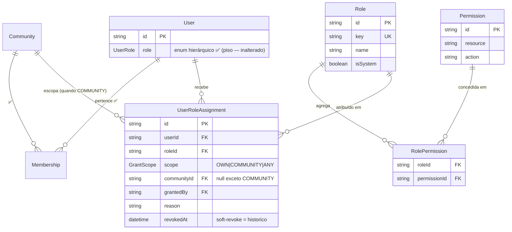

# Modelo de Dados

| | |
|---|---|
| **Domínio** | [[README\|Plataforma de Autorização]] |
| **Última atualização** | 2026-07-24 |

---

## 1. Decisão Central: o que vira tabela, o que vira código, o que é adiado

| Conceito (do escopo pedido) | Destino | Justificativa |
|---|---|---|
| `Role`, `Permission`, `RolePermission`, `UserRoleAssignment` | **Tabela** 🎯 | Estado administrável em runtime (quem tem o quê) — precisa de persistência, auditoria e API |
| `Resource`, `Action`, `ResourceAction` | **Código** (constantes tipadas + seed) | Adicionar recurso/ação **sempre** acompanha deploy de código que o aplica — tabela separada só adiciona joins e uma segunda fonte de verdade. O catálogo válido vive num módulo TS versionado; o seed insere `Permission` a partir dele (RNF-07) |
| `Policy` | **Código** (funções puras registradas) | ADR-009 da Identidade reafirmado: policy é regra de negócio testável em PR, não linha de banco ([[08-Policies]]) |
| `Ability` | **Computada, nunca armazenada** | Resultado de `can()` por request; materializar seria cache — e cache é o `PermissionSet` ([[13-Cache]]) |
| `PolicyAssignment` | **Adiado** | Vincular policies dinamicamente a usuários = policy engine — rejeitado com gatilhos (ADR-AZ-03) |
| `PermissionGroup` | **Adiado (YAGNI)** | `Role` já agrupa permissões; grupo de grupos sem caso de uso concreto |
| `OrganizationRole` | **Absorvido** pelo escopo | `UserRoleAssignment.scope=COMMUNITY + communityId` cumpre o papel sem entidade nova (ADR-AZ-07) |
| `PermissionAudit` | **Absorvido** pela trilha da plataforma | Segunda trilha de auditoria = duas fontes de verdade ([[14-Auditoria]], ADR-AZ-06) |

## 2. Entidades

| Entidade | Campos-chave | Responsabilidade |
|---|---|---|
| `Role` | `id`, `key` (única, ex.: `community-manager`), `name`, `description`, `isSystem` | Papel do catálogo. `isSystem` protege papéis semeados de exclusão via API |
| `Permission` | `id`, `resource`, `action`, `description`; única em `(resource, action)` | Permissão atômica `recurso:ação` — só nasce via seed do catálogo em código |
| `RolePermission` | `roleId`, `permissionId` (PK composta) | Grants do papel |
| `UserRoleAssignment` | `id`, `userId`, `roleId`, `scope` (OWN/COMMUNITY/ANY), `communityId?` (obrigatório se COMMUNITY), `grantedBy`, `reason`, `createdAt`, `revokedAt?` | Atribuição com escopo e cadeia de custódia. **Soft-revoke** (`revokedAt`) — a linha é histórico, nunca deletada |

> [!tip] Índices desde o nascimento (lição da auditoria de [[Banco-de-Dados/Banco-de-Dados|Banco de Dados]]): `user_role_assignments(userId, revokedAt)` (resolução do PermissionSet), `user_role_assignments(roleId)`, `role_permissions(permissionId)`. Nenhuma tabela nova sem seus índices na mesma migration.

## 3. Catálogo em Código (fonte do seed)

```ts
// domain/authorization/catalog/resources.ts
export const RESOURCES = {
  user:          ["read", "update", "block", "export"],
  alert:         ["create", "read", "update", "delete", "accept", "react", "comment"],
  community:     ["read", "manage", "view-metrics"],
  category:      ["read", "manage"],   // cobre events/risks/biomes (dado de referência)
  report:        ["view", "export", "download"],
  dashboard:     ["view"],
  notification:  ["read", "manage"],
  attachment:    ["create", "read", "delete"],
  settings:      ["read", "update"],
  authorization: ["read", "manage"],   // administrar a própria plataforma
  audit:         ["read", "export"],
} as const;

export type Resource = keyof typeof RESOURCES;
export type PermissionKey = `${Resource}:${string}`; // validada contra o catálogo
```

**Naming convention (normativa)**: `recurso:ação`, minúsculas, singular, kebab-case em ações compostas (`view-metrics`). Nunca plural, nunca verbo no nome do recurso, nunca escopo no nome (escopo é coluna — ADR-AZ-04). O tipo `PermissionKey` + teste de seed garantem que string fora do catálogo **não compila/não semeia** — inconsistência de nome vira erro de build, não bug de produção.

## 4. ERD



O enum `User.role` **permanece intocado** — nenhuma migração destrutiva; o catálogo é aditivo (RN-003).

## Ver também

- [[README]] — índice
- [[07-RBAC]] · [[09-Ownership]]
- [[13-Cache]] — como isto vira `PermissionSet`
