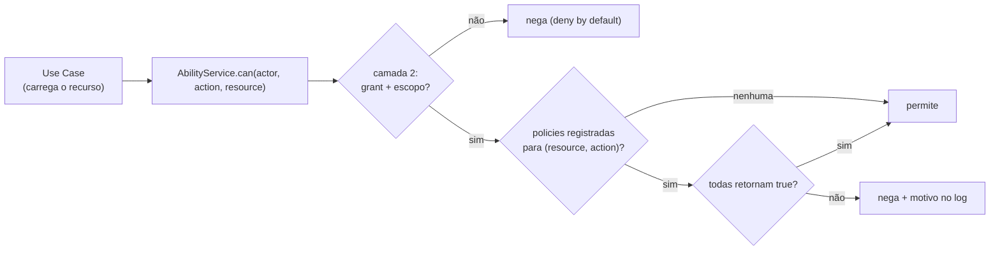

# Policies (Camada 3)

| | |
|---|---|
| **Domínio** | [[README\|Plataforma de Autorização]] |
| **Código-fonte** | `apps/api/src/domain/*/policies/` ✅ |
| **Última atualização** | 2026-07-24 |

---

## 1. Quando Usar Policy (e quando NÃO)

| Situação | Mecanismo |
|---|---|
| "Rota exige patamar" | Camada 1 — `@MinRole` |
| "Tem a permissão X?" | Camada 2 — grant |
| "Pode agir sobre **este** recurso, **neste estado**, dada **sua relação** com ele?" | **Policy** — ex.: alerta `CLOSED` não aceita reação (estado); alerta de saúde visível só a staff/autor (relação+atributo ✅ já existe); reagir duas vezes é proibido (relação) |

Policy **restringe contexto**; nunca concede o que o grant não deu (RN-009). É o ABAC/ReBAC do sistema — atributos e relações avaliados em função pura, sem engine externa (ADR-AZ-03).

## 2. Contrato Padrão — 🎯 (padronização do que já existe ✅)

```ts
// domain/authorization/policy.ts — contrato comum
export interface PolicyContext {
  actor: { userId: string; role: UserRole; memberships: { communityId: string }[] };
}

export type Policy<TResource> = (
  ctx: PolicyContext,
  resource: TResource,
) => boolean; // puro: sem I/O, sem exceção, sem framework

// domain/alerts/policies/can-react-to-alert.ts — exemplo no domínio de negócio
export const canReactToAlert: Policy<Alert> = (ctx, alert) =>
  alert.status === "PENDING";
```

Regras do contrato:

1. **Pura** — recebe tudo que precisa; quem carrega dados é o use case (RNF-06). Se a policy "precisa buscar algo", o desenho está errado — o dado sobe como parâmetro.
2. **Vive no domínio do recurso** (`domain/alerts/policies/`), não na plataforma — coesão com a regra de negócio ([[05-Dominios]] §5). A plataforma define o contrato e compõe.
3. **Nome afirmativo** — `canReactToAlert`, nunca `checkAlert`/`validate`.
4. As policies existentes (`filterAlertsByHealthVisibility` etc. ✅) migram para o contrato **sem mudança de lógica** — só assinatura (task AUTHZ-006).

## 3. Registro e Composição

O `AbilityService` mantém um registro estático `(resource, action) → Policy[]` montado no bootstrap do módulo (não em runtime). Decisão para `can(actor, "alert:react", alert)`: grant+escopo OK (camada 2) **E** todas as policies registradas para `alert:react` retornam `true`. Ausência de policy registrada = sem restrição contextual adicional (o grant decide sozinho).

## 4. Fluxo de Policy



## 5. Teste e Evolução

- **Teste**: tabela de casos por policy (ator × estado do recurso × esperado) — specs puras, sem mock ([[16-Testes]] §2). Policy sem spec não entra no registro (checklist de PR).
- **Evolução**: policy nova = função + spec + registro — nenhuma migração, nenhum deploy de dado. Mudança de regra de negócio = mudança da função no domínio dono, revisada em PR como qualquer regra.
- **Gatilho para engine externa** (reavaliação do ADR-AZ-03): policies administradas por não-desenvolvedores ou compartilhadas entre serviços físicos distintos.

## Ver também

- [[README]] — índice
- [[09-Ownership]] — a família de policies de dono/escopo
- [[10-CASL-ou-Estrategia]] — composição no motor
- [[16-Testes]]
