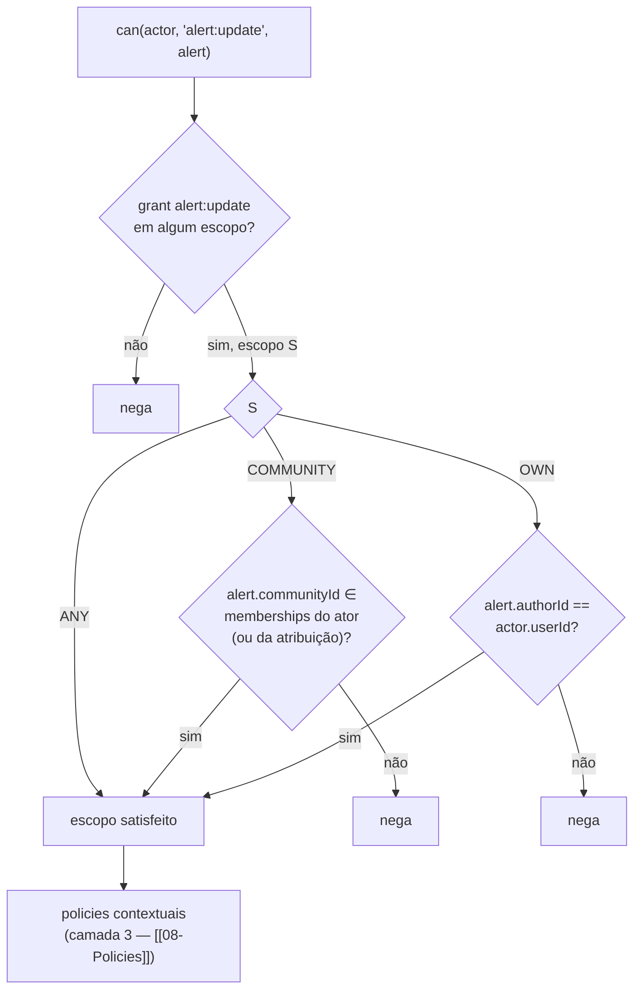

# Ownership e Escopos

| | |
|---|---|
| **Domínio** | [[README\|Plataforma de Autorização]] |
| **Última atualização** | 2026-07-24 |

---

## 1. O Modelo: Escopo no Grant (ADR-AZ-04)

Ownership não é permissão separada (`alert:update:own` ❌) — é o **escopo** do grant (`alert:update` com escopo `OWN`). Três escopos, contidos um no outro:

| Escopo | Alcança | Resolvido por |
|---|---|---|
| `OWN` | Recursos de que o ator é dono (`authorId`/`userId` do recurso) | Comparação direta ator × recurso |
| `COMMUNITY` | Recursos das comunidades de que o ator é membro (ou onde tem a atribuição escopada) | Membership do ator × `communityId` do recurso |
| `ANY` | Global | — |

`ANY ⊃ COMMUNITY ⊃ OWN` (RN-005): quem tem ANY passa em qualquer verificação de escopo menor.

## 2. Os Quatro Perfis Clássicos, Expressos no Modelo

| Perfil | Expressão |
|---|---|
| "Usuário edita só o que criou" | `alert:update` escopo OWN (piso de MEMBER — [[07-RBAC]] §3) |
| "Gestor edita recursos da sua organização" | `community:manage`/`alert:accept` escopo COMMUNITY (papel `community-manager` do catálogo, ou LEADER no Cenário B da Task 15) |
| "Administrador tem acesso global" | Piso de MANAGER/ROOT — grants ANY |
| "Auditor: somente leitura global" | Papel `auditor` do catálogo — `audit:read`/`report:view` ANY, zero grant de mutação |

## 3. Implementação — Resolução de Dono

Cada recurso autorizável declara seu dono e sua comunidade via interface mínima (no domínio do recurso):

```ts
// contrato consumido pelo resolvedor de escopo
export interface Ownable {
  ownerId: string | null;      // Alert.authorId, AlertComment.authorId, ...
  communityId: string | null;  // Alert.communityId; null p/ recursos sem comunidade
}
```

O `AbilityService` resolve: escopo OWN ⇒ `resource.ownerId === actor.userId`; COMMUNITY ⇒ `actor.memberships` contém `resource.communityId` (ou a atribuição escopada aponta para ela); ANY ⇒ true. Recurso sem o campo exigido pelo escopo (ex.: `communityId: null` com grant COMMUNITY) ⇒ **nega** (fail-closed, RN-001).

✅ Base real: `Alert.authorId`/`communityId`, `AlertComment.authorId` já existem no schema — o modelo formaliza o que os dados já suportam; nenhuma migração de dados.

## 4. Fluxo de Ownership



Quando o ator tem o mesmo grant em escopos múltiplos (piso OWN + catálogo COMMUNITY), avalia-se do maior para o menor — primeiro que satisfizer, decide (união, RN-002).

## 5. Organização, Hierarquia Organizacional e Multi-Org (ADR-AZ-07)

**"Organização" no VERACIS é a Comunidade** — a entidade territorial real do domínio ✅. O escopo COMMUNITY é o mecanismo organizacional; `Department`/`Team`/hierarquia de organizações e herança entre níveis organizacionais **não existem no domínio e não são construídos** (YAGNI). Gatilhos para reabrir: (a) VERACIS multi-instituição (várias secretarias/órgãos operando isolados na mesma instância) — aí entra `tenant` (já reservado na [[Autenticacao/10-Tokens|Identidade]]) e uma hierarquia organizacional real; (b) demanda de sub-grupos dentro de comunidade. Até lá, o par (escopo + communityId) cobre o requisito organizacional com uma coluna.

Herança hoje existente e suficiente: hierarquia de **papéis** (patamar inclui os de baixo — RN-003) e continência de **escopos** (§1). Herança organizacional (permissão da org-pai vale na filha) fica explicitamente fora até existir hierarquia de organizações.

## Ver também

- [[README]] — índice
- [[07-RBAC]] · [[08-Policies]]
- [[03-Regras-de-Negocio]] — RN-005, RN-007, RN-008
