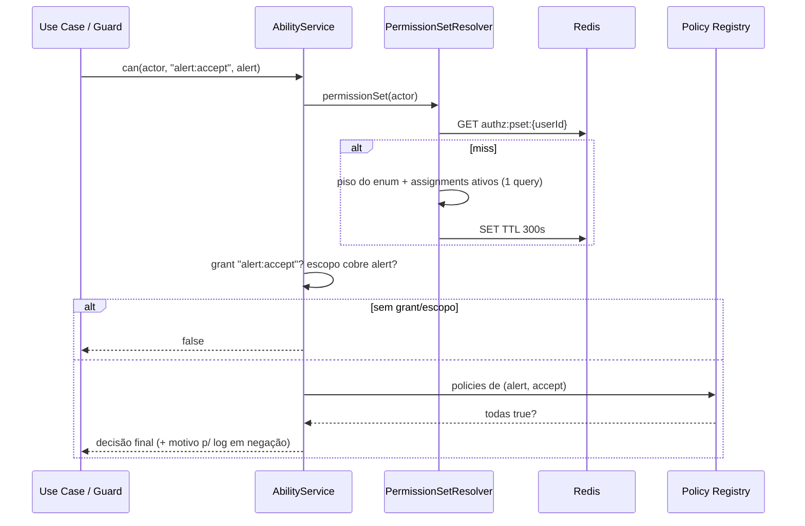

# CASL ou Estratégia Própria — Avaliação e Decisão

| | |
|---|---|
| **Domínio** | [[README\|Plataforma de Autorização]] |
| **Última atualização** | 2026-07-24 |

---

## 1. O Que Está Sendo Decidido

Qual **motor** materializa `can(actor, action, resource?)` — não o modelo (as 3 camadas já estão decididas em ADR-AZ-01). Candidatos avaliados: CASL, ACL clássica, permission matrix estática, policy engine externo, motor próprio.

## 2. Avaliação Comparativa

| Critério | CASL | ACL por recurso | Matrix estática (role×action) | Engine externa (OPA/Cedar) | **Motor próprio (funções puras + AbilityService)** |
|---|---|---|---|---|---|
| Expressividade condicional | Alta (Mongo-style conditions) | Baixa (linha por objeto — explode em volume) | Nula (sem contexto) | Alta | Alta (TS puro — qualquer condição expressável) |
| Aderência à Clean Architecture do projeto | 🟡 Média — abilities dependem da lib; policies de domínio teriam import de framework, violando [[Geral]] §3 ("domínio nunca acoplado à infraestrutura") | — | — | ❌ decisão sai do processo | ✅ Total — camada 3 permanece pura como já é ✅ |
| Performance | Boa (avaliação in-memory) | Ruim em escala | Ótima | Round-trip por decisão | Ótima (uma query cacheada + funções puras) |
| Testabilidade | Boa (abilities testáveis) | — | Trivial | Média (fixture de engine) | ✅ Idêntica ao padrão de testes já existente (specs puras) |
| Compartilhamento com o frontend | ✅ **Diferencial real** — `@casl/ability` + `@casl/react` consomem as mesmas rules serializadas | ❌ | ❌ | ❌ | 🟡 Via `GET /me/abilities` (projeção serializada — cobre o caso de "que botões mostrar" sem duplicar regra) |
| Complexidade adicionada | Média — DSL de conditions, subject detection, edge cases de serialização | Alta em manutenção | Baixa, mas insuficiente | Alta (runtime novo) | Baixa-média (código nosso, padrão já dominado) |
| Manutenção de longo prazo (projeto 10+ anos, handover DATASUS) | Dependência de terceiro no núcleo de segurança | — | — | Runtime a operar | ✅ Sem dependência externa no caminho de decisão |
| Evolução futura | Boa | Ruim | Ruim | Boa | Boa — contrato desenhado CASL-adaptável (§4) |

## 3. Decisão (ADR-AZ-03): Motor Próprio, CASL Adiado com Gatilhos

**Escolha**: `AbilityService` próprio compondo camada 2 (grants+escopo) e camada 3 (policies puras). **Não** é preferência — decorre de três fatos do projeto:

1. **A camada 3 já existe como funções puras** ✅ e a regra arquitetural do projeto proíbe framework no domínio ([[Geral]] §3). Adotar CASL integralmente moveria as regras para abilities acopladas à lib, **ou** manteria as policies puras e usaria CASL só como shell — pagando a dependência sem usar seu poder.
2. **As conditions Mongo-style do CASL brilham quando as regras são dados** (persistidas/serializadas). Aqui, policies são código versionado (ADR-009 da Identidade) — a DSL não compra nada que TS puro já não dê com melhor tipagem e teste.
3. **O único diferencial real do CASL para o VERACIS é o frontend** (mesmas rules no Next.js). Isso é coberto de forma mais barata por `GET /me/abilities` ([[11-API]] §3) — projeção da decisão, não duplicação da regra.

**Gatilhos para reavaliar CASL** (registrados, não retóricos): (a) o frontend passar a precisar de avaliação condicional local rica (offline/otimista) que a projeção de abilities não cubra; (b) o número de policies contextuais crescer a ponto de a composição manual virar o problema. Nesses cenários, o CASL entraria **na borda** (infra/apresentação), consumindo o mesmo catálogo — nunca dentro do domínio.

## 4. O Contrato do Motor (CASL-adaptável por construção)

```ts
// application/authorization/ability.service.ts
export interface Actor {
  userId: string;
  role: UserRole;                       // piso (camada 1→2)
  memberships: { communityId: string }[];
}

export abstract class AbilityService {
  /** decisão pontual — usada por use cases (com recurso) e guards (sem) */
  abstract can(actor: Actor, permission: PermissionKey, resource?: Ownable): Promise<boolean>;
  /** projeção completa — GET /me/abilities e pré-carga de telas */
  abstract abilitiesOf(actor: Actor): Promise<AbilityProjection>;
}

export interface AbilityProjection {
  permissions: { key: PermissionKey; scope: GrantScope }[]; // serializável — formato estável p/ frontend
}
```

`AbilityProjection` é deliberadamente isomórfica a um conjunto de rules CASL (`{ action, subject, conditions }`) — se o gatilho disparar, um adapter converte a projeção em ability CASL no cliente **sem tocar o backend**.

## 5. Fluxo de Ability



## 6. Integração NestJS

- `RolesGuard` (camada 1 — Task 15) e `PermissionGuard` (`@RequirePermission("report:export")`, camada 2 para rotas sem recurso específico) — ambos finos, delegando ao `AbilityService`.
- Decorator de conveniência em use cases **não** — chamada explícita `ability.can(...)` no corpo do use case, visível e testável (mágica de decorator esconderia a decisão do fluxo de leitura do código).
- Telemetria: decisões negadas geram span/atributo via o padrão `Observe*` existente ✅ — negações são sinal de segurança monitorável.

## Ver também

- [[README]] — índice
- [[04-Arquitetura]] §3 · [[08-Policies]] · [[13-Cache]]
- [[17-ADR]] — ADR-AZ-03
