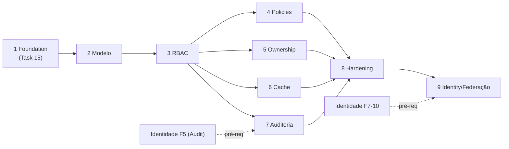

# Roadmap

| | |
|---|---|
| **Domínio** | [[README\|Plataforma de Autorização]] |
| **Última atualização** | 2026-07-24 |

---

> [!important] Este roadmap **detalha** a Fase 3 (Authorization) do [[Autenticacao/18-Roadmap|roadmap da Identidade]] e se estende além dela. As fases daqui se encaixam entre as fases de lá — um único plano, duas lentes. Estimativas: ordem de grandeza, dev-semanas.

## Fase 1 — Foundation (camada 1 + limpeza)

| | |
|---|---|
| **Objetivo** | Autorização de borda funcionando; duplicações mortas |
| **Entregáveis** | Task 15 executada (AUTHZ-001/002): shared kernel `user-role`, `@MinRole`+`RolesGuard`, refactor dos 4+ call sites literais para `isStaff`/policies; rotas staff anotadas; decisão do Passo 4 registrada |
| **Dependências** | Nenhuma |
| **Critérios de aceite** | Rota staff ⇒ 403 antes do use case; zero comparação literal de papel fora do kernel; rotas não anotadas inalteradas; 6 cenários do guard verdes |
| **Riscos** | Mapeamento produto das rotas staff |
| **Estimativa** | ~1,5-2 sem | **Impacto** | 🔴 Fecha o A01 de borda |

## Fase 2 — Modelo de Dados

| | |
|---|---|
| **Objetivo** | Catálogo persistido, sem uso obrigatório |
| **Entregáveis** | Migrations `Role`/`Permission`/`RolePermission`/`UserRoleAssignment` **com índices**; catálogo em código (`RESOURCES`) + seed; papéis de sistema semeados (`auditor`, `community-manager`) |
| **Dependências** | Fase 1 |
| **Critérios de aceite** | Seed idempotente; string fora do catálogo falha build/seed; nenhuma rota alterada |
| **Estimativa** | ~1 sem | **Impacto** | Habilita tudo adiante |

## Fase 3 — RBAC (camada 2 ativa)

| | |
|---|---|
| **Objetivo** | `AbilityService` + atribuições funcionando |
| **Entregáveis** | `AbilityService.can`/`abilitiesOf`; piso→grants implícitos (fixture testada); `PermissionGuard`/`@RequirePermission`; use cases de atribuição (com `reason`, anti-auto-atribuição) |
| **Dependências** | Fase 2 |
| **Critérios de aceite** | União piso+catálogo correta na matriz de testes; primeira rota real usando permissão fina |
| **Riscos** | Validação da tabela de grants implícitos com produto (AUTHZ-004) |
| **Estimativa** | ~2 sem | **Impacto** | Alto |

## Fase 4 — Policies (camada 3 padronizada)

| | |
|---|---|
| **Objetivo** | Policies existentes no contrato comum; registro no motor |
| **Entregáveis** | Contrato `Policy<T>`; migração das policies ✅ (health-visibility etc.) sem mudança de lógica; registro (resource,action)→policies; specs por policy |
| **Dependências** | Fase 3 |
| **Critérios de aceite** | Zero mudança de comportamento (regressão); policy sem spec não registra |
| **Estimativa** | ~1 sem | **Impacto** | Médio |

## Fase 5 — Ownership

| | |
|---|---|
| **Objetivo** | Escopos resolvidos contra recurso real |
| **Entregáveis** | `Ownable` nos recursos autorizáveis; resolução OWN/COMMUNITY/ANY fail-closed; primeiro caso de produto (edição do próprio comentário/alerta) |
| **Dependências** | Fase 3 |
| **Critérios de aceite** | Matriz de ownership de [[16-Testes]] §4 verde |
| **Estimativa** | ~1 sem | **Impacto** | Médio-alto |

## Fase 6 — Cache

| | |
|---|---|
| **Objetivo** | PermissionSet em Redis com invalidação síncrona |
| **Entregáveis** | Resolver+cache; invalidação em atribuição/revogação/`RolePermissionsChanged`/`MembershipChanged`; métricas |
| **Dependências** | Fase 3 | **Critérios** | RN-006 provado em teste de corrida; fallback Redis-fora verde |
| **Estimativa** | ~1 sem | **Impacto** | Performance (RNF-03) |

## Fase 7 — Auditoria

| | |
|---|---|
| **Objetivo** | Concessões na trilha única |
| **Entregáveis** | Eventos de [[12-Eventos]] no `AuditLog` da plataforma; `AUTHORIZATION_ADMIN_DENIED`; export (`/authz/export`) |
| **Dependências** | Fase 3 + Fase 5 da Identidade (a trilha existir) |
| **Critérios** | "Quem concedeu/quando/por quê" respondível por consulta |
| **Estimativa** | ~1 sem | **Impacto** | Compliance |

## Fase 8 — Hardening

| | |
|---|---|
| **Objetivo** | Fechamento ASVS V8 |
| **Entregáveis** | APIs administrativas completas ([[11-API]]) protegidas; teste de inventário de rotas em CI; matriz de segurança ([[16-Testes]] §4) completa; revisão de acesso inaugural |
| **Dependências** | Fases 1-7 | **Critérios** | ASVS V8 sem vermelho; pentest de autorização sem achado alto |
| **Estimativa** | ~1,5 sem | **Impacto** | Alto |

## Fase 9 — Integração Completa com Identity

| | |
|---|---|
| **Objetivo** | Autorização federada |
| **Entregáveis** | Claims `roles`/`permissions` nos tokens (fase 7 da Identidade); mapeamento SCPA→catálogo (fase 10 da Identidade, RN-012); `assuranceLevel` como atributo de policy (step-up por sensibilidade) |
| **Dependências** | Fases 7-10 do roadmap da Identidade |
| **Critérios** | Perfil SCPA refletido em permissões sem tocar o motor; RP externo autoriza via claims |
| **Estimativa** | acoplada às fases da Identidade | **Impacto** | 🔴 Estratégico |

## Ver também

- [[README]] — índice
- [[19-Tasks]] · [[Autenticacao/18-Roadmap|Roadmap da Identidade]]
