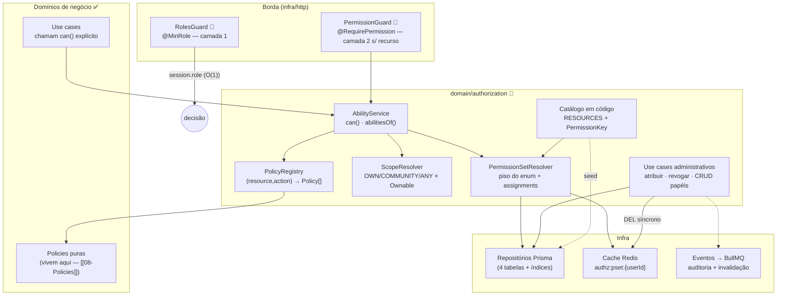

# C4 — Nível 3: Componentes do Módulo Authorization

[[README|Plataforma de Autorização]] › diagrams

Invariantes visíveis no desenho: policies fora do módulo (coesão com o negócio); catálogo em código alimentando seed e resolver (uma fonte de verdade); invalidação de cache com seta **síncrona** a partir da administração, evento apenas tracejado ([[13-Cache]] §3).

## Ver também

- [[C4-Container]] · [[04-Arquitetura]] · [[10-CASL-ou-Estrategia]]
