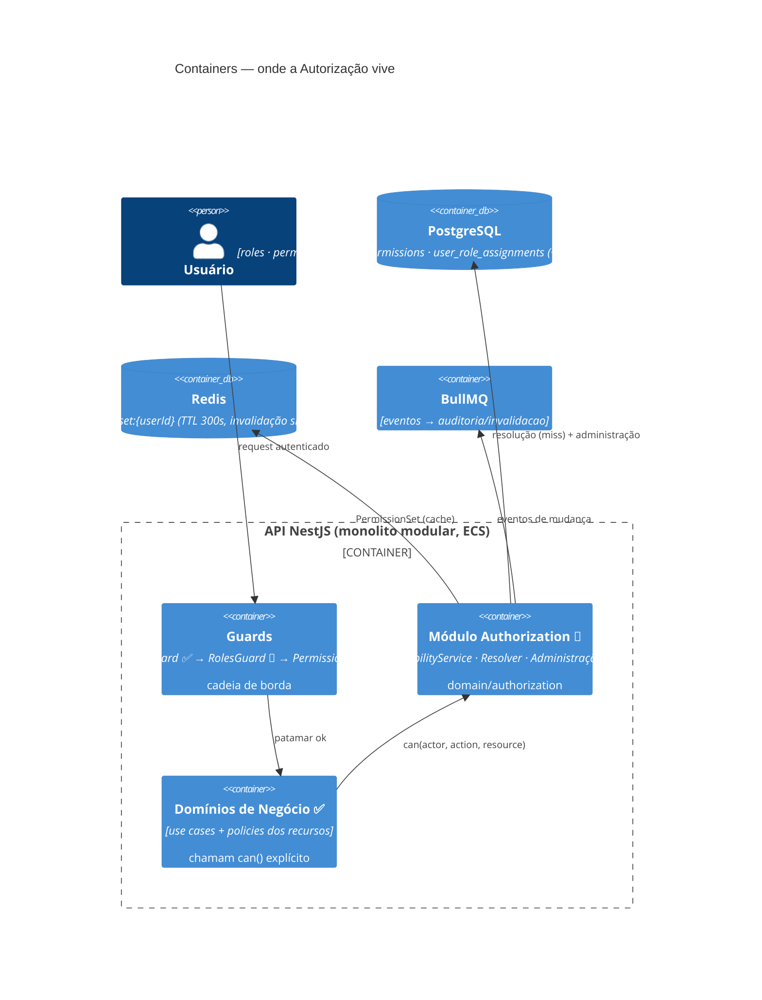

# C4 — Nível 2: Containers

[[README|Plataforma de Autorização]] › diagrams

A Autorização não é um container físico separado — é um **módulo do monolito NestJS** (mesma decisão do Identity Kernel, [[Autenticacao/04-Arquitetura|Arquitetura da Identidade]] §1). O diagrama mostra onde ela vive e o que toca:

## Ver também

- [[C4-Context]] · [[C4-Component]]
- [[Autenticacao/diagrams/C4-Container|C4 Container da Identidade]] — o quadro completo do monolito
