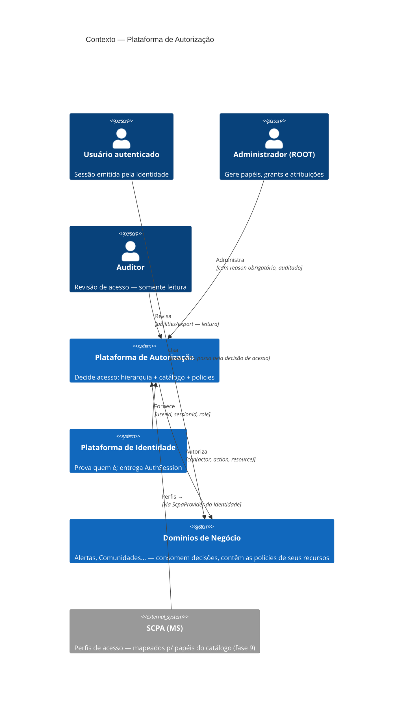

# C4 — Nível 1: Contexto

[[README|Plataforma de Autorização]] › diagrams

```mermaid
C4Context
    title Contexto — Plataforma de Autorização

    Person(user, "Usuário autenticado", "Sessão emitida pela Identidade")
    Person(admin, "Administrador (ROOT)", "Gere papéis, grants e atribuições")
    Person(auditor, "Auditor", "Revisão de acesso — somente leitura")

    System(authz, "Plataforma de Autorização", "Decide acesso: hierarquia + catálogo + policies")
    System(identity, "Plataforma de Identidade", "Prova quem é; entrega AuthSession")
    System(biz, "Domínios de Negócio", "Alertas, Comunidades... — consomem decisões, contêm as policies de seus recursos")
    System_Ext(scpa, "SCPA (MS)", "Perfis de acesso — mapeados p/ papéis do catálogo (fase 9)")

    Rel(user, biz, "Usa", "toda ação passa pela decisão de acesso")
    Rel(identity, authz, "Fornece", "userId, sessionId, role")
    Rel(authz, biz, "Autoriza", "can(actor, action, resource)")
    Rel(admin, authz, "Administra", "com reason obrigatório, auditado")
    Rel(auditor, authz, "Revisa", "abilities/export — leitura")
    Rel(scpa, authz, "Perfis →", "via ScpaProvider da Identidade")
```

## Ver também

- [[C4-Container]] · [[04-Arquitetura]]
