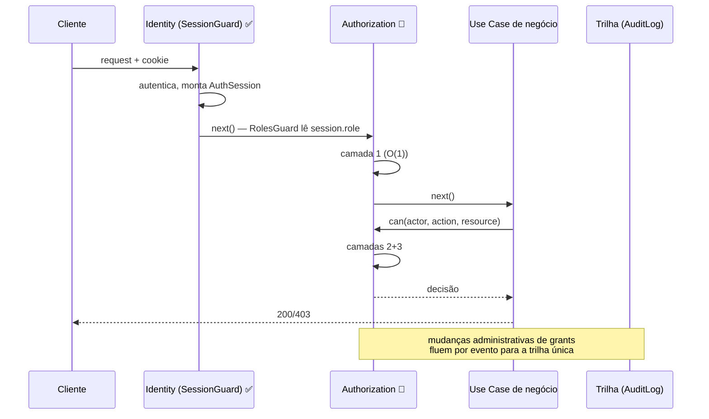

# Comunicação Identity ↔ Authorization

[[README|Plataforma de Autorização]] › diagrams

## 1. O Contrato Entre as Plataformas

| Direção | O quê | Como |
|---|---|---|
| Identity → Authorization | `AuthSession` (`userId`, `sessionId`, `currentUserRole`) ✅; futuramente `provider`/`assuranceLevel` e claims de token | Populada pelo `SessionGuard` no request — a Authorization **nunca** valida sessão, só consome |
| Authorization → Identity | **Nada síncrono.** Zero chamadas — desacoplamento total | — |
| Authorization → trilha | Eventos de concessão/revogação para o `AuditLog` da plataforma | Fila (assíncrono) |
| User (domínio) → Authorization | Memberships (escopo COMMUNITY) e evento `MembershipChanged` | Leitura via contrato + subscriber |

## 2. O Que Viaja no Token (fase de federação)

Quando os tokens da [[Autenticacao/10-Tokens|Identidade]] existirem: `roles` (patamar) e opcionalmente `permissions` viajam como claims **para Resource Servers externos** decidirem localmente. Dentro do monolito, a decisão continua local (PermissionSet + policies) — claims no token são projeção para fora, nunca a fonte interna (mudança administrativa não pode esperar o token expirar; a fonte interna reflete na requisição seguinte — RN-006).

## 3. Regra de Ouro do Desacoplamento

> Identity **nunca** decide acesso (só produz identidade). Authorization **nunca** autentica (só consome identidade). A única superfície comum é a `AuthSession` — contrato estável, versionado junto do `SessionGuard`.

## Ver também

- [[01-Visao-Geral]] §1 — a fronteira
- [[Autenticacao/diagrams/Comunicacao-entre-Servicos|Comunicação da Identidade]]
